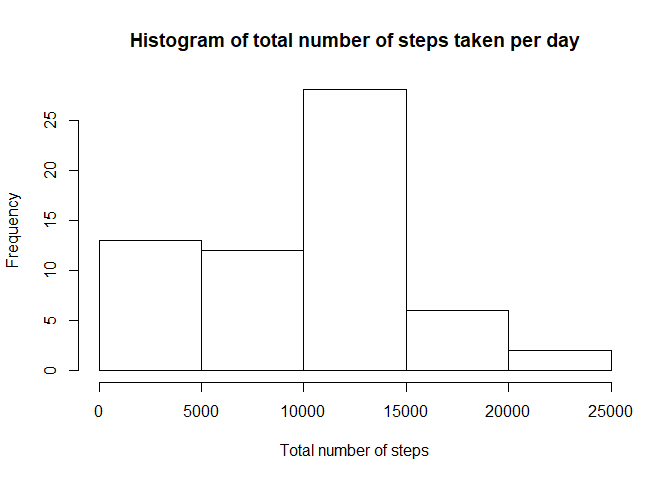
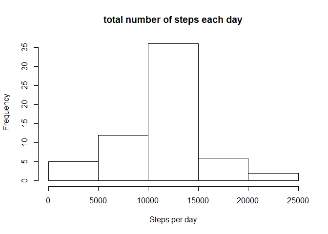
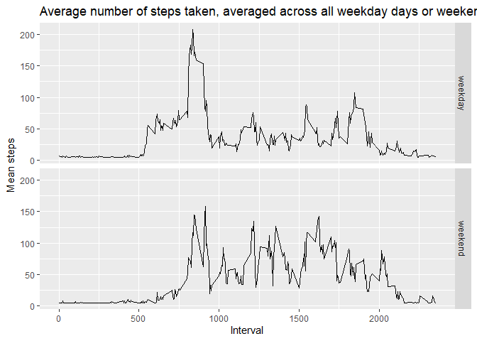

Introduction
------------

It is now possible to collect a large amount of data about personal
movement using activity monitoring devices such as a Fitbit, Nike
Fuelband, or Jawbone Up. These type of devices are part of the
“quantified self” movement – a group of enthusiasts who take
measurements about themselves regularly to improve their health, to find
patterns in their behavior, or because they are tech geeks. But these
data remain under-utilized both because the raw data are hard to obtain
and there is a lack of statistical methods and software for processing
and interpreting the data.

This assignment makes use of data from a personal activity monitoring
device. This device collects data at 5 minute intervals through out the
day. The data consists of two months of data from an anonymous
individual collected during the months of October and November, 2012 and
include the number of steps taken in 5 minute intervals each day.

The data for this assignment can be downloaded from the course web site:

-   Dataset: [Activity monitoring
    data](https://d396qusza40orc.cloudfront.net/repdata%2Fdata%2Factivity.zip)

The variables included in this dataset are:

-   steps: Number of steps taking in a 5-minute interval (missing values
    are coded as 𝙽𝙰)
-   date: The date on which the measurement was taken in YYYY-MM-DD
    format
-   interval: Identifier for the 5-minute interval in which measurement
    was taken

The dataset is stored in a comma-separated-value (CSV) file and there
are a total of 17,568 observations in this dataset.

Loading and preprocessing the data
----------------------------------

    library('ggplot2')

    path <- getwd()

    file_name <- 'activity.csv'
        
    directory <- paste(path ,"data" , file_name, sep = '/')

    url <- "https://d396qusza40orc.cloudfront.net/repdata%2Fdata%2Factivity.zip"

        
    if (file.exists(directory)){
        print("you are good to go")
    } else {
        download.file(url, destfile = directory )
        print('file downloaded and you good to go')
        unzip(zipfile = "dataFiles.zip",exdir = "data") #use it if it's a zip or it's a rar file 
        
    }

    ## [1] "you are good to go"

    Fullactivity <- read.csv("data/activity.csv", header = T)
    clearactivity <- Fullactivity[!is.na(Fullactivity$steps),]
    missingactivity <- Fullactivity[is.na(Fullactivity$steps),]

What is mean total number of steps taken per day?
-------------------------------------------------

For this part of the assignment, you can ignore the missing values in
the dataset.

1.  Calculate the total number of steps taken per day

<!-- -->

    Total_Steps <- aggregate(Fullactivity$steps, by=list(year=Fullactivity$date), FUN=sum ,na.rm = TRUE)

1.  Make a histogram of the total number of steps taken each day

<!-- -->

    hist(Total_Steps$x, main = "Histogram of total number of steps taken per day", xlab = "Total number of steps")

1.  Calculate and report the mean and median of the total number of
    steps taken per day

<!-- -->

    summary(Total_Steps$x)[3]

    ## Median 
    ##  10395

    summary(Total_Steps$x)[4]

    ##    Mean 
    ## 9354.23

What is the average daily activity pattern?
-------------------------------------------

1.  Make a time series plot (i.e. type = “l”) of the 5-minute interval
    (x-axis) and the average number of steps taken, averaged across all
    days (y-axis)

<!-- -->

    avg_steps_per_interval <- aggregate(steps ~ interval, clearactivity, mean)
    plot(avg_steps_per_interval$interval, avg_steps_per_interval$steps, type = "l", main = "Time series plot of the average number of steps taken", xlab = "interval", ylab = "Mean steps")

1.  Which 5-minute interval, on average across all the days in the
    dataset, contains the maximum number of steps?

<!-- -->

    interval_idx <- which.max(avg_steps_per_interval$steps)
    print('the 5-minute interval that contains the maximum number of steps is ')

    ## [1] "the 5-minute interval that contains the maximum number of steps is "

    avg_steps_per_interval[interval_idx, ]$interval

    ## [1] 835

Imputing missing values
-----------------------

Note that there are a number of days/intervals where there are missing
values (coded as NA). The presence of missing days may introduce bias
into some calculations or summaries of the data.

1.  Calculate and report the total number of missing values in the
    dataset

<!-- -->

    dim(missingactivity)[1]

    ## [1] 2304

    dim(missingactivity)[1]/dim(Fullactivity)[1]

    ## [1] 0.1311475

1.  Devise a strategy for filling in all of the missing values in the
    dataset. The strategy does not need to be sophisticated. For
    example, you could use the mean/median for that day, or the mean for
    that 5-minute interval, etc.

<!-- -->

    summary(clearactivity)

    ##      steps                date          interval     
    ##  Min.   :  0.00   2012-10-02:  288   Min.   :   0.0  
    ##  1st Qu.:  0.00   2012-10-03:  288   1st Qu.: 588.8  
    ##  Median :  0.00   2012-10-04:  288   Median :1177.5  
    ##  Mean   : 37.38   2012-10-05:  288   Mean   :1177.5  
    ##  3rd Qu.: 12.00   2012-10-06:  288   3rd Qu.:1766.2  
    ##  Max.   :806.00   2012-10-07:  288   Max.   :2355.0  
    ##                   (Other)   :13536

it’s looks like the median is 0 so i cant fill with meidan but the mean
is more suitable

1.  Create a new dataset that is equal to the original dataset but with
    the missing data filled in.

<!-- -->

    newdf <- data.table::copy(Fullactivity)
    newdf[is.na(newdf$steps),]$steps = mean(newdf$steps, na.rm = TRUE)
    dim(newdf[is.na(newdf$steps),])

    ## [1] 0 3

1.  Make a histogram of the total number of steps taken each day and
    Calculate and report the mean and median total number of steps taken
    per day. Do these values differ from the estimates from the first
    part of the assignment? What is the impact of imputing missing data
    on the estimates of the total daily number of steps?

<!-- -->

    total_steps_per_day <- aggregate(newdf$steps, by=list(year=newdf$date), FUN=sum)
    hist(total_steps_per_day$x, main = "total number of steps each day", xlab = "Steps per day")

old one

    summary(Total_Steps$x)[3]

    ## Median 
    ##  10395

    summary(Total_Steps$x)[4]

    ##    Mean 
    ## 9354.23

new imputed one

    summary(total_steps_per_day$x)[3]

    ##   Median 
    ## 10766.19

    summary(total_steps_per_day$x)[4]

    ##     Mean 
    ## 10766.19

yes it changed but not with much

Are there differences in activity patterns between weekdays and weekends?
-------------------------------------------------------------------------

For this part the weekdays() function may be of some help here. Use the
dataset with the filled-in missing values for this part.

1.  Create a new factor variable in the dataset with two levels –
    “weekday” and “weekend” indicating whether a given date is a weekday
    or weekend day.

<!-- -->

    newdf2<- data.table::copy(newdf)
    newdf2$days <- weekdays(as.Date(newdf$date))

    weekend_days <- grep("Saturday|Sunday", newdf2$days, ignore.case = T)

    newdf2[weekend_days, ]$days = "weekend"

    week_days <- newdf2$days != "weekend"
    newdf2[week_days, ]$days = "weekday"
    table(newdf2$days)

    ## 
    ## weekday weekend 
    ##   12960    4608

    avg_steps_per_day <- aggregate(steps ~ interval+ days, newdf2, mean)

1.  Make a panel plot containing a time series plot (i.e. type = “l”) of
    the 5-minute interval (x-axis) and the average number of steps
    taken, averaged across all weekday days or weekend days (y-axis).
    See the README file in the GitHub repository to see an example of
    what this plot should look like using simulated data.

<!-- -->

    g <- ggplot(avg_steps_per_day, aes(interval, steps))
    g + geom_line() +
        facet_grid(days ~ .) +
        labs(x="Interval", y=expression("Mean steps")) +
        ggtitle("Average number of steps taken, averaged across all weekday days or weekend days")

