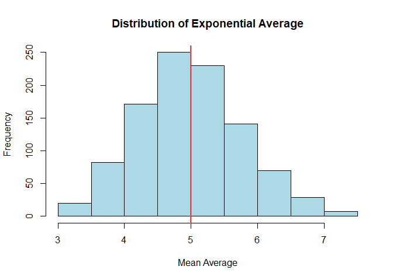
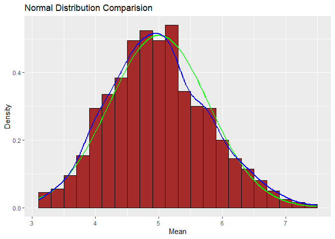
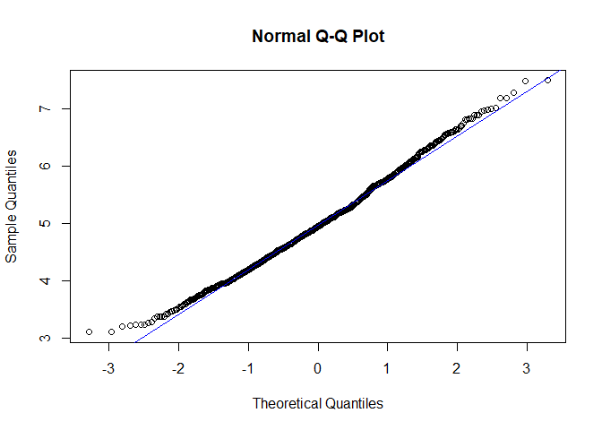

Part 1: Simulation Exercise Instructions
========================================

In this project you will investigate the exponential distribution in R
and compare it with the Central Limit Theorem. The exponential
distribution can be simulated in R with rexp(n, lambda) where lambda is
the rate parameter. The mean of exponential distribution is 1/lambda and
the standard deviation is also 1/lambda. Set lambda = 0.2 for all of the
simulations. You will investigate the distribution of averages of 40
exponentials. Note that you will need to do a thousand simulations.

Illustrate via simulation and associated explanatory text the properties
of the distribution of the mean of 40 exponentials. You should

1.  Show the sample mean and compare it to the theoretical mean of the
    distribution.
2.  Show how variable the sample is (via variance) and compare it to the
    theoretical variance of the distribution.
3.  Show that the distribution is approximately normal.

In point 3, focus on the difference between the distribution of a large
collection of random exponentials and the distribution of a large
collection of averages of 40 exponentials.

As a motivating example, compare the distribution of 1000 random
uniforms

    hist(runif(1000))

and the distribution of 1000 averages of 40 random uniforms

    efmns = NULL
    for (i in 1 : 1000) mns = c(mns, mean(runif(40)))
    hist(mns)

This distribution looks far more Gaussian than the original uniform
distribution!

This exercise is asking you to use your knowledge of the theory given in
class to relate the two distributions.

Confused? Try re-watching video lecture 07 for a starter on how to
complete this project.

**Sample Project Report Structure**

Of course, there are multiple ways one could structure a report to
address the requirements above. However, the more clearly you pose and
answer each question, the easier it will be for reviewers to clearly
identify and evaluate your work.

A sample set of headings that could be used to guide the creation of
your report might be:

-   Title (give an appropriate title) and Author Name
-   Overview: In a few (2-3) sentences explain what is going to be
    reported on.
-   Simulations: Include English explanations of the simulations you
    ran, with the accompanying R code. Your explanations should make
    clear what the R code accomplishes.
-   Sample Mean versus Theoretical Mean: Include figures with titles. In
    the figures, highlight the means you are comparing. Include text
    that explains the figures and what is shown on them, and provides
    appropriate numbers.
-   Sample Variance versus Theoretical Variance: Include figures (output
    from R) with titles. Highlight the variances you are comparing.
    Include text that explains your understanding of the differences of
    the variances.
-   Distribution: Via figures and text, explain how one can tell the
    distribution is approximately normal.

------------------------------------------------------------------------

Solution
========

load needed libs
----------------

    library("ggplot2")

creat simulation
----------------

    # set seed for reproducability
    set.seed(1)
    # set lambda to 0.2
    lambda <- 0.2
    # 40 samples
    n <- 40
    # 1000 simulations
    b <- 1000
    # simulate
    simulated_data <- replicate(b, rexp(n, lambda))
    # calculate mean of exponentials
    means_sim_data <- apply(simulated_data, 2, mean)

Show the sample mean and compare it to the theoretical mean of the distribution
-------------------------------------------------------------------------------

now we go for the mean Comparision of the Sample Mean vs Theoretical
Mean of the Distribution

    # sample mean 
    true_mean <- mean(means_sim_data)
    true_mean

    ## [1] 4.990025

    # Theoretical  mean
    theory_mean <- 1/lambda
    theory_mean

    ## [1] 5

the True mean of the sample were 4.9999 only with only small deffrent
with the theoritacal mean which was 5 that’s a win for us

visualization
-------------

    hist(means_sim_data, col="light blue", xlab = "Mean Average", main="Distribution of Exponential Average")
    abline(v = theory_mean, col="red")
    abline(v = true_mean, col="green")

The analytics mean is 4.993867 the theoretical mean 5. The center of
distribution of averages of 40 exponentials is very close to the
theoretical center of the distribution. and the calulation and the
visualization prove that

Show how variable the sample is (via variance) and compare it to the theoretical variance of the distribution.
--------------------------------------------------------------------------------------------------------------

now we go for the variance Comparision of the Sample variance vs
Theoretical variance of the Distribution

    # sample standard deviation  
    sample_sd <- sd(means_sim_data)
    sample_sd

    ## [1] 0.7817394

    # Theoretical  standard deviation 
    theory_sd <- (1/lambda)/sqrt(n)
    theory_sd

    ## [1] 0.7905694

as we can see there is small diffrent in the sample STD and the
Theoretical standard deviation that will lead to also no deffrent in the
variance lets prove that

    # sample variance 
    sample_var <- sample_sd^2
    sample_var

    ## [1] 0.6111165

    # Theoretical  variance 
    theory_var <- ((1/lambda)*(1/sqrt(n)))^2
    theory_var

    ## [1] 0.625

proven as will from the simulation and the theoretical

Show that the distribution is approximately normal
--------------------------------------------------

    d <- data.frame(means_sim_data)
    t <- data.frame(theory_mean)
    g <- ggplot(d, aes(x = means_sim_data)) +
        geom_histogram(binwidth = .2, color="black", fill="brown" , aes(y=..density..))+
        stat_function(fun=dnorm, args=list(mean=theory_mean, sd=sd(means_sim_data)), color="green", size =1) +
        stat_density(geom = "line", color = "blue", size =1)  +
        labs(x="Mean", y= "Density", title="Normal Distribution Comparision")
    g

 this plot
indicated that density curve is similar to normal distribution curve.

lets compare the distribution of averages of 40 exponentials to a normal
distribution with Q-Q Normal Plot also indicates the normal distribution

    qqnorm(means_sim_data)
     qqline(means_sim_data, col = "blue")

and that prove central limit theorem (CLT) that the distribution of
averages of 40 exponentials is very close to a normal distribution.
