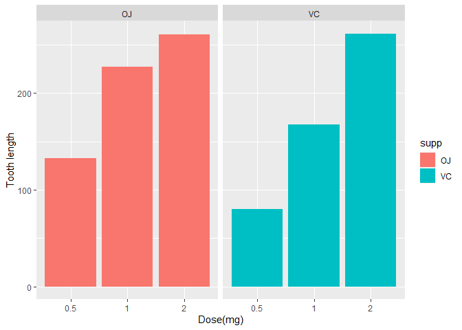
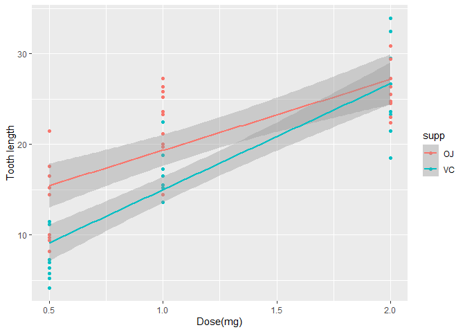

Part 2: Basic Inferential Data Analysis Instructions
====================================================

Now in the second portion of the project, we’re going to analyze the
ToothGrowth data in the R datasets package.

1.  Load the ToothGrowth data and perform some basic exploratory data
    analyses
2.  Provide a basic summary of the data.
3.  Use confidence intervals and/or hypothesis tests to compare tooth
    growth by supp and dose. (Only use the techniques from class, even
    if there’s other approaches worth considering)
4.  State your conclusions and the assumptions needed for your
    conclusions.

<!-- -->

    library(ggplot2)
    library(datasets)

load and explore the data set a bit
-----------------------------------

    data(ToothGrowth)
    str(ToothGrowth)

    ## 'data.frame':    60 obs. of  3 variables:
    ##  $ len : num  4.2 11.5 7.3 5.8 6.4 10 11.2 11.2 5.2 7 ...
    ##  $ supp: Factor w/ 2 levels "OJ","VC": 2 2 2 2 2 2 2 2 2 2 ...
    ##  $ dose: num  0.5 0.5 0.5 0.5 0.5 0.5 0.5 0.5 0.5 0.5 ...

    head(ToothGrowth)

    ##    len supp dose
    ## 1  4.2   VC  0.5
    ## 2 11.5   VC  0.5
    ## 3  7.3   VC  0.5
    ## 4  5.8   VC  0.5
    ## 5  6.4   VC  0.5
    ## 6 10.0   VC  0.5

    tail(ToothGrowth)

    ##     len supp dose
    ## 55 24.8   OJ    2
    ## 56 30.9   OJ    2
    ## 57 26.4   OJ    2
    ## 58 27.3   OJ    2
    ## 59 29.4   OJ    2
    ## 60 23.0   OJ    2

    summary(ToothGrowth)

    ##       len        supp         dose      
    ##  Min.   : 4.20   OJ:30   Min.   :0.500  
    ##  1st Qu.:13.07   VC:30   1st Qu.:0.500  
    ##  Median :19.25           Median :1.000  
    ##  Mean   :18.81           Mean   :1.167  
    ##  3rd Qu.:25.27           3rd Qu.:2.000  
    ##  Max.   :33.90           Max.   :2.000

we have 2 equal supp lets see what is the deffrent there

    ggplot(data=ToothGrowth, aes(x=as.factor(dose), y=len, fill=supp)) +
        geom_bar(stat="identity") +
        facet_grid(. ~ supp) +
        xlab("Dose(mg)") +
        ylab("Tooth length")

 from the
first view i can see that the toth lens in the first, second dose
incresed in OJ supp then VC

    qplot(dose, len, data = ToothGrowth, color = supp, geom = "point") +  geom_smooth(method = "lm")  + labs(x = "Dose(mg)", y = "Tooth length")

    ## `geom_smooth()` using formula 'y ~ x'

 same thing
happned here

basic summary
-------------

    summary(ToothGrowth)

    ##       len        supp         dose      
    ##  Min.   : 4.20   OJ:30   Min.   :0.500  
    ##  1st Qu.:13.07   VC:30   1st Qu.:0.500  
    ##  Median :19.25           Median :1.000  
    ##  Mean   :18.81           Mean   :1.167  
    ##  3rd Qu.:25.27           3rd Qu.:2.000  
    ##  Max.   :33.90           Max.   :2.000

Use confidence intervals and/or hypothesis tests to compare tooth growth by supp and dose. (Only use the techniques from class, even if there’s other approaches worth considering)
-----------------------------------------------------------------------------------------------------------------------------------------------------------------------------------

T-test for dose 0.5 mg:

    dose_.5 <- t.test(len ~ supp, ToothGrowth[ToothGrowth$dose == .5, ])
    dose_.5$p.value

    ## [1] 0.006358607

    dose_.5$conf.int

    ## [1] 1.719057 8.780943
    ## attr(,"conf.level")
    ## [1] 0.95

T-test for dose 1 mg:

    dose_1 <- t.test(len ~ supp, ToothGrowth[ToothGrowth$dose == 1, ])
    dose_1$p.value

    ## [1] 0.001038376

    dose_1$conf.int

    ## [1] 2.802148 9.057852
    ## attr(,"conf.level")
    ## [1] 0.95

T-test for dose 2 mg:

    dose_2 <-t.test(len ~ supp, ToothGrowth[ToothGrowth$dose == 2, ])
    dose_2$p.value

    ## [1] 0.9638516

    dose_1$conf.int

    ## [1] 2.802148 9.057852
    ## attr(,"conf.level")
    ## [1] 0.95

concultion
----------

as we can see we can reject the null in the 3 doses that the type of the
supp can change the tooth growth but increasing the dose level leads to
increased tooth growth.
