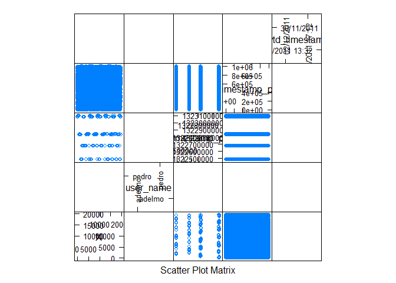
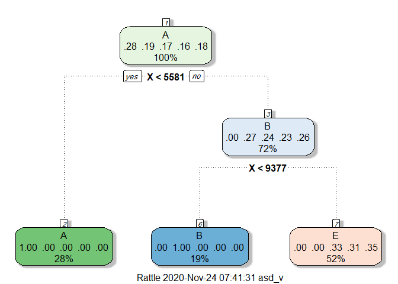

## load libraries 


```r
library(data.table)
library(caret)
```

```
## Loading required package: lattice
```

```
## Loading required package: ggplot2
```

```r
library(ggplot2)
library(randomForest)
```

```
## randomForest 4.6-14
```

```
## Type rfNews() to see new features/changes/bug fixes.
```

```
## 
## Attaching package: 'randomForest'
```

```
## The following object is masked from 'package:ggplot2':
## 
##     margin
```

```r
library(rpart)
library(rpart.plot)
library(rattle)
```

```
## Loading required package: tibble
```

```
## Loading required package: bitops
```

```
## Rattle: A free graphical interface for data science with R.
## Version 5.4.0 Copyright (c) 2006-2020 Togaware Pty Ltd.
## Type 'rattle()' to shake, rattle, and roll your data.
```

```
## 
## Attaching package: 'rattle'
```

```
## The following object is masked from 'package:randomForest':
## 
##     importance
```

```r
set.seed(1)
```

## load data 

```r
train = read.csv("pml-training.csv",na.strings= c("", "NA"))
test = read.csv("pml-testing.csv",na.strings= c("", "NA"))
```

## explore the data 


```r
head(train)
```

```
##   X user_name raw_timestamp_part_1 raw_timestamp_part_2   cvtd_timestamp
## 1 1  carlitos           1323084231               788290 05/12/2011 11:23
## 2 2  carlitos           1323084231               808298 05/12/2011 11:23
## 3 3  carlitos           1323084231               820366 05/12/2011 11:23
## 4 4  carlitos           1323084232               120339 05/12/2011 11:23
## 5 5  carlitos           1323084232               196328 05/12/2011 11:23
## 6 6  carlitos           1323084232               304277 05/12/2011 11:23
##   new_window num_window roll_belt pitch_belt yaw_belt total_accel_belt
## 1         no         11      1.41       8.07    -94.4                3
## 2         no         11      1.41       8.07    -94.4                3
## 3         no         11      1.42       8.07    -94.4                3
## 4         no         12      1.48       8.05    -94.4                3
## 5         no         12      1.48       8.07    -94.4                3
## 6         no         12      1.45       8.06    -94.4                3
##   kurtosis_roll_belt kurtosis_picth_belt kurtosis_yaw_belt skewness_roll_belt
## 1               <NA>                <NA>              <NA>               <NA>
## 2               <NA>                <NA>              <NA>               <NA>
## 3               <NA>                <NA>              <NA>               <NA>
## 4               <NA>                <NA>              <NA>               <NA>
## 5               <NA>                <NA>              <NA>               <NA>
## 6               <NA>                <NA>              <NA>               <NA>
##   skewness_roll_belt.1 skewness_yaw_belt max_roll_belt max_picth_belt
## 1                 <NA>              <NA>            NA             NA
## 2                 <NA>              <NA>            NA             NA
## 3                 <NA>              <NA>            NA             NA
## 4                 <NA>              <NA>            NA             NA
## 5                 <NA>              <NA>            NA             NA
## 6                 <NA>              <NA>            NA             NA
##   max_yaw_belt min_roll_belt min_pitch_belt min_yaw_belt amplitude_roll_belt
## 1         <NA>            NA             NA         <NA>                  NA
## 2         <NA>            NA             NA         <NA>                  NA
## 3         <NA>            NA             NA         <NA>                  NA
## 4         <NA>            NA             NA         <NA>                  NA
## 5         <NA>            NA             NA         <NA>                  NA
## 6         <NA>            NA             NA         <NA>                  NA
##   amplitude_pitch_belt amplitude_yaw_belt var_total_accel_belt avg_roll_belt
## 1                   NA               <NA>                   NA            NA
## 2                   NA               <NA>                   NA            NA
## 3                   NA               <NA>                   NA            NA
## 4                   NA               <NA>                   NA            NA
## 5                   NA               <NA>                   NA            NA
## 6                   NA               <NA>                   NA            NA
##   stddev_roll_belt var_roll_belt avg_pitch_belt stddev_pitch_belt
## 1               NA            NA             NA                NA
## 2               NA            NA             NA                NA
## 3               NA            NA             NA                NA
## 4               NA            NA             NA                NA
## 5               NA            NA             NA                NA
## 6               NA            NA             NA                NA
##   var_pitch_belt avg_yaw_belt stddev_yaw_belt var_yaw_belt gyros_belt_x
## 1             NA           NA              NA           NA         0.00
## 2             NA           NA              NA           NA         0.02
## 3             NA           NA              NA           NA         0.00
## 4             NA           NA              NA           NA         0.02
## 5             NA           NA              NA           NA         0.02
## 6             NA           NA              NA           NA         0.02
##   gyros_belt_y gyros_belt_z accel_belt_x accel_belt_y accel_belt_z
## 1         0.00        -0.02          -21            4           22
## 2         0.00        -0.02          -22            4           22
## 3         0.00        -0.02          -20            5           23
## 4         0.00        -0.03          -22            3           21
## 5         0.02        -0.02          -21            2           24
## 6         0.00        -0.02          -21            4           21
##   magnet_belt_x magnet_belt_y magnet_belt_z roll_arm pitch_arm yaw_arm
## 1            -3           599          -313     -128      22.5    -161
## 2            -7           608          -311     -128      22.5    -161
## 3            -2           600          -305     -128      22.5    -161
## 4            -6           604          -310     -128      22.1    -161
## 5            -6           600          -302     -128      22.1    -161
## 6             0           603          -312     -128      22.0    -161
##   total_accel_arm var_accel_arm avg_roll_arm stddev_roll_arm var_roll_arm
## 1              34            NA           NA              NA           NA
## 2              34            NA           NA              NA           NA
## 3              34            NA           NA              NA           NA
## 4              34            NA           NA              NA           NA
## 5              34            NA           NA              NA           NA
## 6              34            NA           NA              NA           NA
##   avg_pitch_arm stddev_pitch_arm var_pitch_arm avg_yaw_arm stddev_yaw_arm
## 1            NA               NA            NA          NA             NA
## 2            NA               NA            NA          NA             NA
## 3            NA               NA            NA          NA             NA
## 4            NA               NA            NA          NA             NA
## 5            NA               NA            NA          NA             NA
## 6            NA               NA            NA          NA             NA
##   var_yaw_arm gyros_arm_x gyros_arm_y gyros_arm_z accel_arm_x accel_arm_y
## 1          NA        0.00        0.00       -0.02        -288         109
## 2          NA        0.02       -0.02       -0.02        -290         110
## 3          NA        0.02       -0.02       -0.02        -289         110
## 4          NA        0.02       -0.03        0.02        -289         111
## 5          NA        0.00       -0.03        0.00        -289         111
## 6          NA        0.02       -0.03        0.00        -289         111
##   accel_arm_z magnet_arm_x magnet_arm_y magnet_arm_z kurtosis_roll_arm
## 1        -123         -368          337          516              <NA>
## 2        -125         -369          337          513              <NA>
## 3        -126         -368          344          513              <NA>
## 4        -123         -372          344          512              <NA>
## 5        -123         -374          337          506              <NA>
## 6        -122         -369          342          513              <NA>
##   kurtosis_picth_arm kurtosis_yaw_arm skewness_roll_arm skewness_pitch_arm
## 1               <NA>             <NA>              <NA>               <NA>
## 2               <NA>             <NA>              <NA>               <NA>
## 3               <NA>             <NA>              <NA>               <NA>
## 4               <NA>             <NA>              <NA>               <NA>
## 5               <NA>             <NA>              <NA>               <NA>
## 6               <NA>             <NA>              <NA>               <NA>
##   skewness_yaw_arm max_roll_arm max_picth_arm max_yaw_arm min_roll_arm
## 1             <NA>           NA            NA          NA           NA
## 2             <NA>           NA            NA          NA           NA
## 3             <NA>           NA            NA          NA           NA
## 4             <NA>           NA            NA          NA           NA
## 5             <NA>           NA            NA          NA           NA
## 6             <NA>           NA            NA          NA           NA
##   min_pitch_arm min_yaw_arm amplitude_roll_arm amplitude_pitch_arm
## 1            NA          NA                 NA                  NA
## 2            NA          NA                 NA                  NA
## 3            NA          NA                 NA                  NA
## 4            NA          NA                 NA                  NA
## 5            NA          NA                 NA                  NA
## 6            NA          NA                 NA                  NA
##   amplitude_yaw_arm roll_dumbbell pitch_dumbbell yaw_dumbbell
## 1                NA      13.05217      -70.49400    -84.87394
## 2                NA      13.13074      -70.63751    -84.71065
## 3                NA      12.85075      -70.27812    -85.14078
## 4                NA      13.43120      -70.39379    -84.87363
## 5                NA      13.37872      -70.42856    -84.85306
## 6                NA      13.38246      -70.81759    -84.46500
##   kurtosis_roll_dumbbell kurtosis_picth_dumbbell kurtosis_yaw_dumbbell
## 1                   <NA>                    <NA>                  <NA>
## 2                   <NA>                    <NA>                  <NA>
## 3                   <NA>                    <NA>                  <NA>
## 4                   <NA>                    <NA>                  <NA>
## 5                   <NA>                    <NA>                  <NA>
## 6                   <NA>                    <NA>                  <NA>
##   skewness_roll_dumbbell skewness_pitch_dumbbell skewness_yaw_dumbbell
## 1                   <NA>                    <NA>                  <NA>
## 2                   <NA>                    <NA>                  <NA>
## 3                   <NA>                    <NA>                  <NA>
## 4                   <NA>                    <NA>                  <NA>
## 5                   <NA>                    <NA>                  <NA>
## 6                   <NA>                    <NA>                  <NA>
##   max_roll_dumbbell max_picth_dumbbell max_yaw_dumbbell min_roll_dumbbell
## 1                NA                 NA             <NA>                NA
## 2                NA                 NA             <NA>                NA
## 3                NA                 NA             <NA>                NA
## 4                NA                 NA             <NA>                NA
## 5                NA                 NA             <NA>                NA
## 6                NA                 NA             <NA>                NA
##   min_pitch_dumbbell min_yaw_dumbbell amplitude_roll_dumbbell
## 1                 NA             <NA>                      NA
## 2                 NA             <NA>                      NA
## 3                 NA             <NA>                      NA
## 4                 NA             <NA>                      NA
## 5                 NA             <NA>                      NA
## 6                 NA             <NA>                      NA
##   amplitude_pitch_dumbbell amplitude_yaw_dumbbell total_accel_dumbbell
## 1                       NA                   <NA>                   37
## 2                       NA                   <NA>                   37
## 3                       NA                   <NA>                   37
## 4                       NA                   <NA>                   37
## 5                       NA                   <NA>                   37
## 6                       NA                   <NA>                   37
##   var_accel_dumbbell avg_roll_dumbbell stddev_roll_dumbbell var_roll_dumbbell
## 1                 NA                NA                   NA                NA
## 2                 NA                NA                   NA                NA
## 3                 NA                NA                   NA                NA
## 4                 NA                NA                   NA                NA
## 5                 NA                NA                   NA                NA
## 6                 NA                NA                   NA                NA
##   avg_pitch_dumbbell stddev_pitch_dumbbell var_pitch_dumbbell avg_yaw_dumbbell
## 1                 NA                    NA                 NA               NA
## 2                 NA                    NA                 NA               NA
## 3                 NA                    NA                 NA               NA
## 4                 NA                    NA                 NA               NA
## 5                 NA                    NA                 NA               NA
## 6                 NA                    NA                 NA               NA
##   stddev_yaw_dumbbell var_yaw_dumbbell gyros_dumbbell_x gyros_dumbbell_y
## 1                  NA               NA                0            -0.02
## 2                  NA               NA                0            -0.02
## 3                  NA               NA                0            -0.02
## 4                  NA               NA                0            -0.02
## 5                  NA               NA                0            -0.02
## 6                  NA               NA                0            -0.02
##   gyros_dumbbell_z accel_dumbbell_x accel_dumbbell_y accel_dumbbell_z
## 1             0.00             -234               47             -271
## 2             0.00             -233               47             -269
## 3             0.00             -232               46             -270
## 4            -0.02             -232               48             -269
## 5             0.00             -233               48             -270
## 6             0.00             -234               48             -269
##   magnet_dumbbell_x magnet_dumbbell_y magnet_dumbbell_z roll_forearm
## 1              -559               293               -65         28.4
## 2              -555               296               -64         28.3
## 3              -561               298               -63         28.3
## 4              -552               303               -60         28.1
## 5              -554               292               -68         28.0
## 6              -558               294               -66         27.9
##   pitch_forearm yaw_forearm kurtosis_roll_forearm kurtosis_picth_forearm
## 1         -63.9        -153                  <NA>                   <NA>
## 2         -63.9        -153                  <NA>                   <NA>
## 3         -63.9        -152                  <NA>                   <NA>
## 4         -63.9        -152                  <NA>                   <NA>
## 5         -63.9        -152                  <NA>                   <NA>
## 6         -63.9        -152                  <NA>                   <NA>
##   kurtosis_yaw_forearm skewness_roll_forearm skewness_pitch_forearm
## 1                 <NA>                  <NA>                   <NA>
## 2                 <NA>                  <NA>                   <NA>
## 3                 <NA>                  <NA>                   <NA>
## 4                 <NA>                  <NA>                   <NA>
## 5                 <NA>                  <NA>                   <NA>
## 6                 <NA>                  <NA>                   <NA>
##   skewness_yaw_forearm max_roll_forearm max_picth_forearm max_yaw_forearm
## 1                 <NA>               NA                NA            <NA>
## 2                 <NA>               NA                NA            <NA>
## 3                 <NA>               NA                NA            <NA>
## 4                 <NA>               NA                NA            <NA>
## 5                 <NA>               NA                NA            <NA>
## 6                 <NA>               NA                NA            <NA>
##   min_roll_forearm min_pitch_forearm min_yaw_forearm amplitude_roll_forearm
## 1               NA                NA            <NA>                     NA
## 2               NA                NA            <NA>                     NA
## 3               NA                NA            <NA>                     NA
## 4               NA                NA            <NA>                     NA
## 5               NA                NA            <NA>                     NA
## 6               NA                NA            <NA>                     NA
##   amplitude_pitch_forearm amplitude_yaw_forearm total_accel_forearm
## 1                      NA                  <NA>                  36
## 2                      NA                  <NA>                  36
## 3                      NA                  <NA>                  36
## 4                      NA                  <NA>                  36
## 5                      NA                  <NA>                  36
## 6                      NA                  <NA>                  36
##   var_accel_forearm avg_roll_forearm stddev_roll_forearm var_roll_forearm
## 1                NA               NA                  NA               NA
## 2                NA               NA                  NA               NA
## 3                NA               NA                  NA               NA
## 4                NA               NA                  NA               NA
## 5                NA               NA                  NA               NA
## 6                NA               NA                  NA               NA
##   avg_pitch_forearm stddev_pitch_forearm var_pitch_forearm avg_yaw_forearm
## 1                NA                   NA                NA              NA
## 2                NA                   NA                NA              NA
## 3                NA                   NA                NA              NA
## 4                NA                   NA                NA              NA
## 5                NA                   NA                NA              NA
## 6                NA                   NA                NA              NA
##   stddev_yaw_forearm var_yaw_forearm gyros_forearm_x gyros_forearm_y
## 1                 NA              NA            0.03            0.00
## 2                 NA              NA            0.02            0.00
## 3                 NA              NA            0.03           -0.02
## 4                 NA              NA            0.02           -0.02
## 5                 NA              NA            0.02            0.00
## 6                 NA              NA            0.02           -0.02
##   gyros_forearm_z accel_forearm_x accel_forearm_y accel_forearm_z
## 1           -0.02             192             203            -215
## 2           -0.02             192             203            -216
## 3            0.00             196             204            -213
## 4            0.00             189             206            -214
## 5           -0.02             189             206            -214
## 6           -0.03             193             203            -215
##   magnet_forearm_x magnet_forearm_y magnet_forearm_z classe
## 1              -17              654              476      A
## 2              -18              661              473      A
## 3              -18              658              469      A
## 4              -16              658              469      A
## 5              -17              655              473      A
## 6               -9              660              478      A
```


```r
dim(train)
```

```
## [1] 19622   160
```

```r
dim(test)
```

```
## [1]  20 160
```

## cleaning data set 

there seems to be alot of NA cloumns 


```r
#Remove NA cols
todrop_columns <-colSums(is.na(train))<.8*nrow(train)
train <- train[,todrop_columns]
test <- test[,todrop_columns]
dim(train)
```

```
## [1] 19622    60
```

```r
dim(test)
```

```
## [1] 20 60
```

```r
colnames(train) == colnames(test)
```

```
##  [1]  TRUE  TRUE  TRUE  TRUE  TRUE  TRUE  TRUE  TRUE  TRUE  TRUE  TRUE  TRUE
## [13]  TRUE  TRUE  TRUE  TRUE  TRUE  TRUE  TRUE  TRUE  TRUE  TRUE  TRUE  TRUE
## [25]  TRUE  TRUE  TRUE  TRUE  TRUE  TRUE  TRUE  TRUE  TRUE  TRUE  TRUE  TRUE
## [37]  TRUE  TRUE  TRUE  TRUE  TRUE  TRUE  TRUE  TRUE  TRUE  TRUE  TRUE  TRUE
## [49]  TRUE  TRUE  TRUE  TRUE  TRUE  TRUE  TRUE  TRUE  TRUE  TRUE  TRUE FALSE
```


```r
head(train)
```

```
##   X user_name raw_timestamp_part_1 raw_timestamp_part_2   cvtd_timestamp
## 1 1  carlitos           1323084231               788290 05/12/2011 11:23
## 2 2  carlitos           1323084231               808298 05/12/2011 11:23
## 3 3  carlitos           1323084231               820366 05/12/2011 11:23
## 4 4  carlitos           1323084232               120339 05/12/2011 11:23
## 5 5  carlitos           1323084232               196328 05/12/2011 11:23
## 6 6  carlitos           1323084232               304277 05/12/2011 11:23
##   new_window num_window roll_belt pitch_belt yaw_belt total_accel_belt
## 1         no         11      1.41       8.07    -94.4                3
## 2         no         11      1.41       8.07    -94.4                3
## 3         no         11      1.42       8.07    -94.4                3
## 4         no         12      1.48       8.05    -94.4                3
## 5         no         12      1.48       8.07    -94.4                3
## 6         no         12      1.45       8.06    -94.4                3
##   gyros_belt_x gyros_belt_y gyros_belt_z accel_belt_x accel_belt_y accel_belt_z
## 1         0.00         0.00        -0.02          -21            4           22
## 2         0.02         0.00        -0.02          -22            4           22
## 3         0.00         0.00        -0.02          -20            5           23
## 4         0.02         0.00        -0.03          -22            3           21
## 5         0.02         0.02        -0.02          -21            2           24
## 6         0.02         0.00        -0.02          -21            4           21
##   magnet_belt_x magnet_belt_y magnet_belt_z roll_arm pitch_arm yaw_arm
## 1            -3           599          -313     -128      22.5    -161
## 2            -7           608          -311     -128      22.5    -161
## 3            -2           600          -305     -128      22.5    -161
## 4            -6           604          -310     -128      22.1    -161
## 5            -6           600          -302     -128      22.1    -161
## 6             0           603          -312     -128      22.0    -161
##   total_accel_arm gyros_arm_x gyros_arm_y gyros_arm_z accel_arm_x accel_arm_y
## 1              34        0.00        0.00       -0.02        -288         109
## 2              34        0.02       -0.02       -0.02        -290         110
## 3              34        0.02       -0.02       -0.02        -289         110
## 4              34        0.02       -0.03        0.02        -289         111
## 5              34        0.00       -0.03        0.00        -289         111
## 6              34        0.02       -0.03        0.00        -289         111
##   accel_arm_z magnet_arm_x magnet_arm_y magnet_arm_z roll_dumbbell
## 1        -123         -368          337          516      13.05217
## 2        -125         -369          337          513      13.13074
## 3        -126         -368          344          513      12.85075
## 4        -123         -372          344          512      13.43120
## 5        -123         -374          337          506      13.37872
## 6        -122         -369          342          513      13.38246
##   pitch_dumbbell yaw_dumbbell total_accel_dumbbell gyros_dumbbell_x
## 1      -70.49400    -84.87394                   37                0
## 2      -70.63751    -84.71065                   37                0
## 3      -70.27812    -85.14078                   37                0
## 4      -70.39379    -84.87363                   37                0
## 5      -70.42856    -84.85306                   37                0
## 6      -70.81759    -84.46500                   37                0
##   gyros_dumbbell_y gyros_dumbbell_z accel_dumbbell_x accel_dumbbell_y
## 1            -0.02             0.00             -234               47
## 2            -0.02             0.00             -233               47
## 3            -0.02             0.00             -232               46
## 4            -0.02            -0.02             -232               48
## 5            -0.02             0.00             -233               48
## 6            -0.02             0.00             -234               48
##   accel_dumbbell_z magnet_dumbbell_x magnet_dumbbell_y magnet_dumbbell_z
## 1             -271              -559               293               -65
## 2             -269              -555               296               -64
## 3             -270              -561               298               -63
## 4             -269              -552               303               -60
## 5             -270              -554               292               -68
## 6             -269              -558               294               -66
##   roll_forearm pitch_forearm yaw_forearm total_accel_forearm gyros_forearm_x
## 1         28.4         -63.9        -153                  36            0.03
## 2         28.3         -63.9        -153                  36            0.02
## 3         28.3         -63.9        -152                  36            0.03
## 4         28.1         -63.9        -152                  36            0.02
## 5         28.0         -63.9        -152                  36            0.02
## 6         27.9         -63.9        -152                  36            0.02
##   gyros_forearm_y gyros_forearm_z accel_forearm_x accel_forearm_y
## 1            0.00           -0.02             192             203
## 2            0.00           -0.02             192             203
## 3           -0.02            0.00             196             204
## 4           -0.02            0.00             189             206
## 5            0.00           -0.02             189             206
## 6           -0.02           -0.03             193             203
##   accel_forearm_z magnet_forearm_x magnet_forearm_y magnet_forearm_z classe
## 1            -215              -17              654              476      A
## 2            -216              -18              661              473      A
## 3            -213              -18              658              469      A
## 4            -214              -16              658              469      A
## 5            -214              -17              655              473      A
## 6            -215               -9              660              478      A
```
## explore more 


```r
splom(classe~train[1:5], data = train)
```

```
## Warning in panel.xyplot(..., identifier = identifier): NAs introduced by
## coercion

## Warning in panel.xyplot(..., identifier = identifier): NAs introduced by
## coercion

## Warning in panel.xyplot(..., identifier = identifier): NAs introduced by
## coercion

## Warning in panel.xyplot(..., identifier = identifier): NAs introduced by
## coercion

## Warning in panel.xyplot(..., identifier = identifier): NAs introduced by
## coercion

## Warning in panel.xyplot(..., identifier = identifier): NAs introduced by
## coercion

## Warning in panel.xyplot(..., identifier = identifier): NAs introduced by
## coercion

## Warning in panel.xyplot(..., identifier = identifier): NAs introduced by
## coercion

## Warning in panel.xyplot(..., identifier = identifier): NAs introduced by
## coercion

## Warning in panel.xyplot(..., identifier = identifier): NAs introduced by
## coercion

## Warning in panel.xyplot(..., identifier = identifier): NAs introduced by
## coercion

## Warning in panel.xyplot(..., identifier = identifier): NAs introduced by
## coercion

## Warning in panel.xyplot(..., identifier = identifier): NAs introduced by
## coercion

## Warning in panel.xyplot(..., identifier = identifier): NAs introduced by
## coercion

## Warning in panel.xyplot(..., identifier = identifier): NAs introduced by
## coercion

## Warning in panel.xyplot(..., identifier = identifier): NAs introduced by
## coercion
```

<!-- -->


```r
barplot(table(train$classe))
```

<!-- -->

## split the train data set 


```r
inTrain = createDataPartition(train$classe, p = 3/4)[[1]]
training = train[ inTrain,]
testing = train[-inTrain,]
```

## start fitting the models 

### random forest 


```r
training$classe = factor(training$classe) 
model_rf <- randomForest( classe ~ .,  data =training,  ntree = 250)
pred_rf <- predict(model_rf, testing)
rf1 <- table(pred_rf, testing$classe)
confusionMatrix(rf1)
```

```
## Confusion Matrix and Statistics
## 
##        
## pred_rf    A    B    C    D    E
##       A 1395    0    0    0    0
##       B    0  949    0    0    0
##       C    0    0  855    0    0
##       D    0    0    0  804    0
##       E    0    0    0    0  901
## 
## Overall Statistics
##                                      
##                Accuracy : 1          
##                  95% CI : (0.9992, 1)
##     No Information Rate : 0.2845     
##     P-Value [Acc > NIR] : < 2.2e-16  
##                                      
##                   Kappa : 1          
##                                      
##  Mcnemar's Test P-Value : NA         
## 
## Statistics by Class:
## 
##                      Class: A Class: B Class: C Class: D Class: E
## Sensitivity            1.0000   1.0000   1.0000   1.0000   1.0000
## Specificity            1.0000   1.0000   1.0000   1.0000   1.0000
## Pos Pred Value         1.0000   1.0000   1.0000   1.0000   1.0000
## Neg Pred Value         1.0000   1.0000   1.0000   1.0000   1.0000
## Prevalence             0.2845   0.1935   0.1743   0.1639   0.1837
## Detection Rate         0.2845   0.1935   0.1743   0.1639   0.1837
## Detection Prevalence   0.2845   0.1935   0.1743   0.1639   0.1837
## Balanced Accuracy      1.0000   1.0000   1.0000   1.0000   1.0000
```
### Liner Discriminant Analysis


```r
model_lda <- train(classe ~ ., data = training, method = "lda")
```

```
## Warning in lda.default(x, grouping, ...): variables are collinear

## Warning in lda.default(x, grouping, ...): variables are collinear

## Warning in lda.default(x, grouping, ...): variables are collinear

## Warning in lda.default(x, grouping, ...): variables are collinear

## Warning in lda.default(x, grouping, ...): variables are collinear

## Warning in lda.default(x, grouping, ...): variables are collinear

## Warning in lda.default(x, grouping, ...): variables are collinear

## Warning in lda.default(x, grouping, ...): variables are collinear

## Warning in lda.default(x, grouping, ...): variables are collinear

## Warning in lda.default(x, grouping, ...): variables are collinear

## Warning in lda.default(x, grouping, ...): variables are collinear

## Warning in lda.default(x, grouping, ...): variables are collinear

## Warning in lda.default(x, grouping, ...): variables are collinear

## Warning in lda.default(x, grouping, ...): variables are collinear

## Warning in lda.default(x, grouping, ...): variables are collinear

## Warning in lda.default(x, grouping, ...): variables are collinear

## Warning in lda.default(x, grouping, ...): variables are collinear

## Warning in lda.default(x, grouping, ...): variables are collinear

## Warning in lda.default(x, grouping, ...): variables are collinear

## Warning in lda.default(x, grouping, ...): variables are collinear

## Warning in lda.default(x, grouping, ...): variables are collinear

## Warning in lda.default(x, grouping, ...): variables are collinear

## Warning in lda.default(x, grouping, ...): variables are collinear

## Warning in lda.default(x, grouping, ...): variables are collinear

## Warning in lda.default(x, grouping, ...): variables are collinear

## Warning in lda.default(x, grouping, ...): variables are collinear
```

```r
pred_lda <- predict(model_lda, testing)
lda1 <- table(pred_lda, testing$classe)
confusionMatrix(lda1)
```

```
## Confusion Matrix and Statistics
## 
##         
## pred_lda    A    B    C    D    E
##        A 1395    0    0    0    0
##        B    0  948    0    0    0
##        C    0    1  855    0    0
##        D    0    0    0  804    0
##        E    0    0    0    0  901
## 
## Overall Statistics
##                                      
##                Accuracy : 0.9998     
##                  95% CI : (0.9989, 1)
##     No Information Rate : 0.2845     
##     P-Value [Acc > NIR] : < 2.2e-16  
##                                      
##                   Kappa : 0.9997     
##                                      
##  Mcnemar's Test P-Value : NA         
## 
## Statistics by Class:
## 
##                      Class: A Class: B Class: C Class: D Class: E
## Sensitivity            1.0000   0.9989   1.0000   1.0000   1.0000
## Specificity            1.0000   1.0000   0.9998   1.0000   1.0000
## Pos Pred Value         1.0000   1.0000   0.9988   1.0000   1.0000
## Neg Pred Value         1.0000   0.9997   1.0000   1.0000   1.0000
## Prevalence             0.2845   0.1935   0.1743   0.1639   0.1837
## Detection Rate         0.2845   0.1933   0.1743   0.1639   0.1837
## Detection Prevalence   0.2845   0.1933   0.1746   0.1639   0.1837
## Balanced Accuracy      1.0000   0.9995   0.9999   1.0000   1.0000
```


### Recursive Partitioning and Regression Trees


```r
model_rpart <- train(classe ~ ., data = training, method = "rpart")
pred_rpart<- predict(model_rpart, testing)
rpart1 <- table(pred_rpart, testing$classe)
confusionMatrix(rpart1)
```

```
## Confusion Matrix and Statistics
## 
##           
## pred_rpart    A    B    C    D    E
##          A 1395    0    0    0    0
##          B    0  948    0    0    0
##          C    0    0    0    0    0
##          D    0    0    0    0    0
##          E    0    1  855  804  901
## 
## Overall Statistics
##                                           
##                Accuracy : 0.6615          
##                  95% CI : (0.6481, 0.6747)
##     No Information Rate : 0.2845          
##     P-Value [Acc > NIR] : < 2.2e-16       
##                                           
##                   Kappa : 0.5692          
##                                           
##  Mcnemar's Test P-Value : NA              
## 
## Statistics by Class:
## 
##                      Class: A Class: B Class: C Class: D Class: E
## Sensitivity            1.0000   0.9989   0.0000   0.0000   1.0000
## Specificity            1.0000   1.0000   1.0000   1.0000   0.5853
## Pos Pred Value         1.0000   1.0000      NaN      NaN   0.3518
## Neg Pred Value         1.0000   0.9997   0.8257   0.8361   1.0000
## Prevalence             0.2845   0.1935   0.1743   0.1639   0.1837
## Detection Rate         0.2845   0.1933   0.0000   0.0000   0.1837
## Detection Prevalence   0.2845   0.1933   0.0000   0.0000   0.5222
## Balanced Accuracy      1.0000   0.9995   0.5000   0.5000   0.7927
```

plot the tree 


```r
library(rattle)
fancyRpartPlot(model_rpart$finalModel)
```

<!-- -->


## summury
it looks like the random forest model has the higest Accuracy  so i will stick with it 

```r
final_data <- predict(model_rf, test)
final_data
```

```
##  1  2  3  4  5  6  7  8  9 10 11 12 13 14 15 16 17 18 19 20 
##  A  A  A  A  A  A  A  A  A  A  A  A  A  A  A  A  A  A  A  A 
## Levels: A B C D E
```

