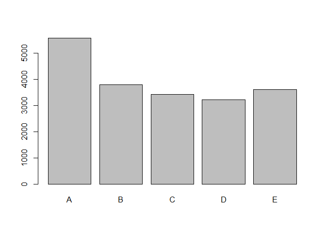
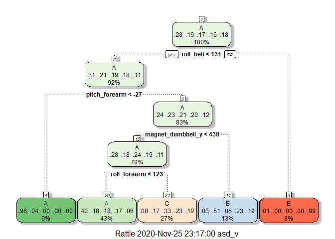
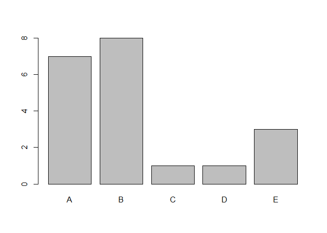

## load libraries 


```r
library(data.table)
library(caret)
```

```
## Loading required package: lattice
```

```
## Loading required package: ggplot2
```

```r
library(ggplot2)
library(randomForest)
```

```
## randomForest 4.6-14
```

```
## Type rfNews() to see new features/changes/bug fixes.
```

```
## 
## Attaching package: 'randomForest'
```

```
## The following object is masked from 'package:ggplot2':
## 
##     margin
```

```r
library(rpart)
library(rpart.plot)
library(rattle)
```

```
## Loading required package: tibble
```

```
## Loading required package: bitops
```

```
## Rattle: A free graphical interface for data science with R.
## Version 5.4.0 Copyright (c) 2006-2020 Togaware Pty Ltd.
## Type 'rattle()' to shake, rattle, and roll your data.
```

```
## 
## Attaching package: 'rattle'
```

```
## The following object is masked from 'package:randomForest':
## 
##     importance
```

```r
set.seed(12345)
```

## load data 

```r
train = read.csv("pml-training.csv",na.strings= c("", "NA"))
test = read.csv("pml-testing.csv",na.strings= c("", "NA"))
```

## explore the data 


```r
head(train)
```

```
##   X user_name raw_timestamp_part_1 raw_timestamp_part_2   cvtd_timestamp
## 1 1  carlitos           1323084231               788290 05/12/2011 11:23
## 2 2  carlitos           1323084231               808298 05/12/2011 11:23
## 3 3  carlitos           1323084231               820366 05/12/2011 11:23
## 4 4  carlitos           1323084232               120339 05/12/2011 11:23
## 5 5  carlitos           1323084232               196328 05/12/2011 11:23
## 6 6  carlitos           1323084232               304277 05/12/2011 11:23
##   new_window num_window roll_belt pitch_belt yaw_belt total_accel_belt
## 1         no         11      1.41       8.07    -94.4                3
## 2         no         11      1.41       8.07    -94.4                3
## 3         no         11      1.42       8.07    -94.4                3
## 4         no         12      1.48       8.05    -94.4                3
## 5         no         12      1.48       8.07    -94.4                3
## 6         no         12      1.45       8.06    -94.4                3
##   kurtosis_roll_belt kurtosis_picth_belt kurtosis_yaw_belt skewness_roll_belt
## 1               <NA>                <NA>              <NA>               <NA>
## 2               <NA>                <NA>              <NA>               <NA>
## 3               <NA>                <NA>              <NA>               <NA>
## 4               <NA>                <NA>              <NA>               <NA>
## 5               <NA>                <NA>              <NA>               <NA>
## 6               <NA>                <NA>              <NA>               <NA>
##   skewness_roll_belt.1 skewness_yaw_belt max_roll_belt max_picth_belt
## 1                 <NA>              <NA>            NA             NA
## 2                 <NA>              <NA>            NA             NA
## 3                 <NA>              <NA>            NA             NA
## 4                 <NA>              <NA>            NA             NA
## 5                 <NA>              <NA>            NA             NA
## 6                 <NA>              <NA>            NA             NA
##   max_yaw_belt min_roll_belt min_pitch_belt min_yaw_belt amplitude_roll_belt
## 1         <NA>            NA             NA         <NA>                  NA
## 2         <NA>            NA             NA         <NA>                  NA
## 3         <NA>            NA             NA         <NA>                  NA
## 4         <NA>            NA             NA         <NA>                  NA
## 5         <NA>            NA             NA         <NA>                  NA
## 6         <NA>            NA             NA         <NA>                  NA
##   amplitude_pitch_belt amplitude_yaw_belt var_total_accel_belt avg_roll_belt
## 1                   NA               <NA>                   NA            NA
## 2                   NA               <NA>                   NA            NA
## 3                   NA               <NA>                   NA            NA
## 4                   NA               <NA>                   NA            NA
## 5                   NA               <NA>                   NA            NA
## 6                   NA               <NA>                   NA            NA
##   stddev_roll_belt var_roll_belt avg_pitch_belt stddev_pitch_belt
## 1               NA            NA             NA                NA
## 2               NA            NA             NA                NA
## 3               NA            NA             NA                NA
## 4               NA            NA             NA                NA
## 5               NA            NA             NA                NA
## 6               NA            NA             NA                NA
##   var_pitch_belt avg_yaw_belt stddev_yaw_belt var_yaw_belt gyros_belt_x
## 1             NA           NA              NA           NA         0.00
## 2             NA           NA              NA           NA         0.02
## 3             NA           NA              NA           NA         0.00
## 4             NA           NA              NA           NA         0.02
## 5             NA           NA              NA           NA         0.02
## 6             NA           NA              NA           NA         0.02
##   gyros_belt_y gyros_belt_z accel_belt_x accel_belt_y accel_belt_z
## 1         0.00        -0.02          -21            4           22
## 2         0.00        -0.02          -22            4           22
## 3         0.00        -0.02          -20            5           23
## 4         0.00        -0.03          -22            3           21
## 5         0.02        -0.02          -21            2           24
## 6         0.00        -0.02          -21            4           21
##   magnet_belt_x magnet_belt_y magnet_belt_z roll_arm pitch_arm yaw_arm
## 1            -3           599          -313     -128      22.5    -161
## 2            -7           608          -311     -128      22.5    -161
## 3            -2           600          -305     -128      22.5    -161
## 4            -6           604          -310     -128      22.1    -161
## 5            -6           600          -302     -128      22.1    -161
## 6             0           603          -312     -128      22.0    -161
##   total_accel_arm var_accel_arm avg_roll_arm stddev_roll_arm var_roll_arm
## 1              34            NA           NA              NA           NA
## 2              34            NA           NA              NA           NA
## 3              34            NA           NA              NA           NA
## 4              34            NA           NA              NA           NA
## 5              34            NA           NA              NA           NA
## 6              34            NA           NA              NA           NA
##   avg_pitch_arm stddev_pitch_arm var_pitch_arm avg_yaw_arm stddev_yaw_arm
## 1            NA               NA            NA          NA             NA
## 2            NA               NA            NA          NA             NA
## 3            NA               NA            NA          NA             NA
## 4            NA               NA            NA          NA             NA
## 5            NA               NA            NA          NA             NA
## 6            NA               NA            NA          NA             NA
##   var_yaw_arm gyros_arm_x gyros_arm_y gyros_arm_z accel_arm_x accel_arm_y
## 1          NA        0.00        0.00       -0.02        -288         109
## 2          NA        0.02       -0.02       -0.02        -290         110
## 3          NA        0.02       -0.02       -0.02        -289         110
## 4          NA        0.02       -0.03        0.02        -289         111
## 5          NA        0.00       -0.03        0.00        -289         111
## 6          NA        0.02       -0.03        0.00        -289         111
##   accel_arm_z magnet_arm_x magnet_arm_y magnet_arm_z kurtosis_roll_arm
## 1        -123         -368          337          516              <NA>
## 2        -125         -369          337          513              <NA>
## 3        -126         -368          344          513              <NA>
## 4        -123         -372          344          512              <NA>
## 5        -123         -374          337          506              <NA>
## 6        -122         -369          342          513              <NA>
##   kurtosis_picth_arm kurtosis_yaw_arm skewness_roll_arm skewness_pitch_arm
## 1               <NA>             <NA>              <NA>               <NA>
## 2               <NA>             <NA>              <NA>               <NA>
## 3               <NA>             <NA>              <NA>               <NA>
## 4               <NA>             <NA>              <NA>               <NA>
## 5               <NA>             <NA>              <NA>               <NA>
## 6               <NA>             <NA>              <NA>               <NA>
##   skewness_yaw_arm max_roll_arm max_picth_arm max_yaw_arm min_roll_arm
## 1             <NA>           NA            NA          NA           NA
## 2             <NA>           NA            NA          NA           NA
## 3             <NA>           NA            NA          NA           NA
## 4             <NA>           NA            NA          NA           NA
## 5             <NA>           NA            NA          NA           NA
## 6             <NA>           NA            NA          NA           NA
##   min_pitch_arm min_yaw_arm amplitude_roll_arm amplitude_pitch_arm
## 1            NA          NA                 NA                  NA
## 2            NA          NA                 NA                  NA
## 3            NA          NA                 NA                  NA
## 4            NA          NA                 NA                  NA
## 5            NA          NA                 NA                  NA
## 6            NA          NA                 NA                  NA
##   amplitude_yaw_arm roll_dumbbell pitch_dumbbell yaw_dumbbell
## 1                NA      13.05217      -70.49400    -84.87394
## 2                NA      13.13074      -70.63751    -84.71065
## 3                NA      12.85075      -70.27812    -85.14078
## 4                NA      13.43120      -70.39379    -84.87363
## 5                NA      13.37872      -70.42856    -84.85306
## 6                NA      13.38246      -70.81759    -84.46500
##   kurtosis_roll_dumbbell kurtosis_picth_dumbbell kurtosis_yaw_dumbbell
## 1                   <NA>                    <NA>                  <NA>
## 2                   <NA>                    <NA>                  <NA>
## 3                   <NA>                    <NA>                  <NA>
## 4                   <NA>                    <NA>                  <NA>
## 5                   <NA>                    <NA>                  <NA>
## 6                   <NA>                    <NA>                  <NA>
##   skewness_roll_dumbbell skewness_pitch_dumbbell skewness_yaw_dumbbell
## 1                   <NA>                    <NA>                  <NA>
## 2                   <NA>                    <NA>                  <NA>
## 3                   <NA>                    <NA>                  <NA>
## 4                   <NA>                    <NA>                  <NA>
## 5                   <NA>                    <NA>                  <NA>
## 6                   <NA>                    <NA>                  <NA>
##   max_roll_dumbbell max_picth_dumbbell max_yaw_dumbbell min_roll_dumbbell
## 1                NA                 NA             <NA>                NA
## 2                NA                 NA             <NA>                NA
## 3                NA                 NA             <NA>                NA
## 4                NA                 NA             <NA>                NA
## 5                NA                 NA             <NA>                NA
## 6                NA                 NA             <NA>                NA
##   min_pitch_dumbbell min_yaw_dumbbell amplitude_roll_dumbbell
## 1                 NA             <NA>                      NA
## 2                 NA             <NA>                      NA
## 3                 NA             <NA>                      NA
## 4                 NA             <NA>                      NA
## 5                 NA             <NA>                      NA
## 6                 NA             <NA>                      NA
##   amplitude_pitch_dumbbell amplitude_yaw_dumbbell total_accel_dumbbell
## 1                       NA                   <NA>                   37
## 2                       NA                   <NA>                   37
## 3                       NA                   <NA>                   37
## 4                       NA                   <NA>                   37
## 5                       NA                   <NA>                   37
## 6                       NA                   <NA>                   37
##   var_accel_dumbbell avg_roll_dumbbell stddev_roll_dumbbell var_roll_dumbbell
## 1                 NA                NA                   NA                NA
## 2                 NA                NA                   NA                NA
## 3                 NA                NA                   NA                NA
## 4                 NA                NA                   NA                NA
## 5                 NA                NA                   NA                NA
## 6                 NA                NA                   NA                NA
##   avg_pitch_dumbbell stddev_pitch_dumbbell var_pitch_dumbbell avg_yaw_dumbbell
## 1                 NA                    NA                 NA               NA
## 2                 NA                    NA                 NA               NA
## 3                 NA                    NA                 NA               NA
## 4                 NA                    NA                 NA               NA
## 5                 NA                    NA                 NA               NA
## 6                 NA                    NA                 NA               NA
##   stddev_yaw_dumbbell var_yaw_dumbbell gyros_dumbbell_x gyros_dumbbell_y
## 1                  NA               NA                0            -0.02
## 2                  NA               NA                0            -0.02
## 3                  NA               NA                0            -0.02
## 4                  NA               NA                0            -0.02
## 5                  NA               NA                0            -0.02
## 6                  NA               NA                0            -0.02
##   gyros_dumbbell_z accel_dumbbell_x accel_dumbbell_y accel_dumbbell_z
## 1             0.00             -234               47             -271
## 2             0.00             -233               47             -269
## 3             0.00             -232               46             -270
## 4            -0.02             -232               48             -269
## 5             0.00             -233               48             -270
## 6             0.00             -234               48             -269
##   magnet_dumbbell_x magnet_dumbbell_y magnet_dumbbell_z roll_forearm
## 1              -559               293               -65         28.4
## 2              -555               296               -64         28.3
## 3              -561               298               -63         28.3
## 4              -552               303               -60         28.1
## 5              -554               292               -68         28.0
## 6              -558               294               -66         27.9
##   pitch_forearm yaw_forearm kurtosis_roll_forearm kurtosis_picth_forearm
## 1         -63.9        -153                  <NA>                   <NA>
## 2         -63.9        -153                  <NA>                   <NA>
## 3         -63.9        -152                  <NA>                   <NA>
## 4         -63.9        -152                  <NA>                   <NA>
## 5         -63.9        -152                  <NA>                   <NA>
## 6         -63.9        -152                  <NA>                   <NA>
##   kurtosis_yaw_forearm skewness_roll_forearm skewness_pitch_forearm
## 1                 <NA>                  <NA>                   <NA>
## 2                 <NA>                  <NA>                   <NA>
## 3                 <NA>                  <NA>                   <NA>
## 4                 <NA>                  <NA>                   <NA>
## 5                 <NA>                  <NA>                   <NA>
## 6                 <NA>                  <NA>                   <NA>
##   skewness_yaw_forearm max_roll_forearm max_picth_forearm max_yaw_forearm
## 1                 <NA>               NA                NA            <NA>
## 2                 <NA>               NA                NA            <NA>
## 3                 <NA>               NA                NA            <NA>
## 4                 <NA>               NA                NA            <NA>
## 5                 <NA>               NA                NA            <NA>
## 6                 <NA>               NA                NA            <NA>
##   min_roll_forearm min_pitch_forearm min_yaw_forearm amplitude_roll_forearm
## 1               NA                NA            <NA>                     NA
## 2               NA                NA            <NA>                     NA
## 3               NA                NA            <NA>                     NA
## 4               NA                NA            <NA>                     NA
## 5               NA                NA            <NA>                     NA
## 6               NA                NA            <NA>                     NA
##   amplitude_pitch_forearm amplitude_yaw_forearm total_accel_forearm
## 1                      NA                  <NA>                  36
## 2                      NA                  <NA>                  36
## 3                      NA                  <NA>                  36
## 4                      NA                  <NA>                  36
## 5                      NA                  <NA>                  36
## 6                      NA                  <NA>                  36
##   var_accel_forearm avg_roll_forearm stddev_roll_forearm var_roll_forearm
## 1                NA               NA                  NA               NA
## 2                NA               NA                  NA               NA
## 3                NA               NA                  NA               NA
## 4                NA               NA                  NA               NA
## 5                NA               NA                  NA               NA
## 6                NA               NA                  NA               NA
##   avg_pitch_forearm stddev_pitch_forearm var_pitch_forearm avg_yaw_forearm
## 1                NA                   NA                NA              NA
## 2                NA                   NA                NA              NA
## 3                NA                   NA                NA              NA
## 4                NA                   NA                NA              NA
## 5                NA                   NA                NA              NA
## 6                NA                   NA                NA              NA
##   stddev_yaw_forearm var_yaw_forearm gyros_forearm_x gyros_forearm_y
## 1                 NA              NA            0.03            0.00
## 2                 NA              NA            0.02            0.00
## 3                 NA              NA            0.03           -0.02
## 4                 NA              NA            0.02           -0.02
## 5                 NA              NA            0.02            0.00
## 6                 NA              NA            0.02           -0.02
##   gyros_forearm_z accel_forearm_x accel_forearm_y accel_forearm_z
## 1           -0.02             192             203            -215
## 2           -0.02             192             203            -216
## 3            0.00             196             204            -213
## 4            0.00             189             206            -214
## 5           -0.02             189             206            -214
## 6           -0.03             193             203            -215
##   magnet_forearm_x magnet_forearm_y magnet_forearm_z classe
## 1              -17              654              476      A
## 2              -18              661              473      A
## 3              -18              658              469      A
## 4              -16              658              469      A
## 5              -17              655              473      A
## 6               -9              660              478      A
```


```r
summary(train)
```

```
##        X          user_name         raw_timestamp_part_1 raw_timestamp_part_2
##  Min.   :    1   Length:19622       Min.   :1.322e+09    Min.   :   294      
##  1st Qu.: 4906   Class :character   1st Qu.:1.323e+09    1st Qu.:252912      
##  Median : 9812   Mode  :character   Median :1.323e+09    Median :496380      
##  Mean   : 9812                      Mean   :1.323e+09    Mean   :500656      
##  3rd Qu.:14717                      3rd Qu.:1.323e+09    3rd Qu.:751891      
##  Max.   :19622                      Max.   :1.323e+09    Max.   :998801      
##                                                                              
##  cvtd_timestamp      new_window          num_window      roll_belt     
##  Length:19622       Length:19622       Min.   :  1.0   Min.   :-28.90  
##  Class :character   Class :character   1st Qu.:222.0   1st Qu.:  1.10  
##  Mode  :character   Mode  :character   Median :424.0   Median :113.00  
##                                        Mean   :430.6   Mean   : 64.41  
##                                        3rd Qu.:644.0   3rd Qu.:123.00  
##                                        Max.   :864.0   Max.   :162.00  
##                                                                        
##    pitch_belt          yaw_belt       total_accel_belt kurtosis_roll_belt
##  Min.   :-55.8000   Min.   :-180.00   Min.   : 0.00    Length:19622      
##  1st Qu.:  1.7600   1st Qu.: -88.30   1st Qu.: 3.00    Class :character  
##  Median :  5.2800   Median : -13.00   Median :17.00    Mode  :character  
##  Mean   :  0.3053   Mean   : -11.21   Mean   :11.31                      
##  3rd Qu.: 14.9000   3rd Qu.:  12.90   3rd Qu.:18.00                      
##  Max.   : 60.3000   Max.   : 179.00   Max.   :29.00                      
##                                                                          
##  kurtosis_picth_belt kurtosis_yaw_belt  skewness_roll_belt skewness_roll_belt.1
##  Length:19622        Length:19622       Length:19622       Length:19622        
##  Class :character    Class :character   Class :character   Class :character    
##  Mode  :character    Mode  :character   Mode  :character   Mode  :character    
##                                                                                
##                                                                                
##                                                                                
##                                                                                
##  skewness_yaw_belt  max_roll_belt     max_picth_belt  max_yaw_belt      
##  Length:19622       Min.   :-94.300   Min.   : 3.00   Length:19622      
##  Class :character   1st Qu.:-88.000   1st Qu.: 5.00   Class :character  
##  Mode  :character   Median : -5.100   Median :18.00   Mode  :character  
##                     Mean   : -6.667   Mean   :12.92                     
##                     3rd Qu.: 18.500   3rd Qu.:19.00                     
##                     Max.   :180.000   Max.   :30.00                     
##                     NA's   :19216     NA's   :19216                     
##  min_roll_belt     min_pitch_belt  min_yaw_belt       amplitude_roll_belt
##  Min.   :-180.00   Min.   : 0.00   Length:19622       Min.   :  0.000    
##  1st Qu.: -88.40   1st Qu.: 3.00   Class :character   1st Qu.:  0.300    
##  Median :  -7.85   Median :16.00   Mode  :character   Median :  1.000    
##  Mean   : -10.44   Mean   :10.76                      Mean   :  3.769    
##  3rd Qu.:   9.05   3rd Qu.:17.00                      3rd Qu.:  2.082    
##  Max.   : 173.00   Max.   :23.00                      Max.   :360.000    
##  NA's   :19216     NA's   :19216                      NA's   :19216      
##  amplitude_pitch_belt amplitude_yaw_belt var_total_accel_belt avg_roll_belt   
##  Min.   : 0.000       Length:19622       Min.   : 0.000       Min.   :-27.40  
##  1st Qu.: 1.000       Class :character   1st Qu.: 0.100       1st Qu.:  1.10  
##  Median : 1.000       Mode  :character   Median : 0.200       Median :116.35  
##  Mean   : 2.167                          Mean   : 0.926       Mean   : 68.06  
##  3rd Qu.: 2.000                          3rd Qu.: 0.300       3rd Qu.:123.38  
##  Max.   :12.000                          Max.   :16.500       Max.   :157.40  
##  NA's   :19216                           NA's   :19216        NA's   :19216   
##  stddev_roll_belt var_roll_belt     avg_pitch_belt    stddev_pitch_belt
##  Min.   : 0.000   Min.   :  0.000   Min.   :-51.400   Min.   :0.000    
##  1st Qu.: 0.200   1st Qu.:  0.000   1st Qu.:  2.025   1st Qu.:0.200    
##  Median : 0.400   Median :  0.100   Median :  5.200   Median :0.400    
##  Mean   : 1.337   Mean   :  7.699   Mean   :  0.520   Mean   :0.603    
##  3rd Qu.: 0.700   3rd Qu.:  0.500   3rd Qu.: 15.775   3rd Qu.:0.700    
##  Max.   :14.200   Max.   :200.700   Max.   : 59.700   Max.   :4.000    
##  NA's   :19216    NA's   :19216     NA's   :19216     NA's   :19216    
##  var_pitch_belt    avg_yaw_belt      stddev_yaw_belt    var_yaw_belt      
##  Min.   : 0.000   Min.   :-138.300   Min.   :  0.000   Min.   :    0.000  
##  1st Qu.: 0.000   1st Qu.: -88.175   1st Qu.:  0.100   1st Qu.:    0.010  
##  Median : 0.100   Median :  -6.550   Median :  0.300   Median :    0.090  
##  Mean   : 0.766   Mean   :  -8.831   Mean   :  1.341   Mean   :  107.487  
##  3rd Qu.: 0.500   3rd Qu.:  14.125   3rd Qu.:  0.700   3rd Qu.:    0.475  
##  Max.   :16.200   Max.   : 173.500   Max.   :176.600   Max.   :31183.240  
##  NA's   :19216    NA's   :19216      NA's   :19216     NA's   :19216      
##   gyros_belt_x        gyros_belt_y       gyros_belt_z      accel_belt_x     
##  Min.   :-1.040000   Min.   :-0.64000   Min.   :-1.4600   Min.   :-120.000  
##  1st Qu.:-0.030000   1st Qu.: 0.00000   1st Qu.:-0.2000   1st Qu.: -21.000  
##  Median : 0.030000   Median : 0.02000   Median :-0.1000   Median : -15.000  
##  Mean   :-0.005592   Mean   : 0.03959   Mean   :-0.1305   Mean   :  -5.595  
##  3rd Qu.: 0.110000   3rd Qu.: 0.11000   3rd Qu.:-0.0200   3rd Qu.:  -5.000  
##  Max.   : 2.220000   Max.   : 0.64000   Max.   : 1.6200   Max.   :  85.000  
##                                                                             
##   accel_belt_y     accel_belt_z     magnet_belt_x   magnet_belt_y  
##  Min.   :-69.00   Min.   :-275.00   Min.   :-52.0   Min.   :354.0  
##  1st Qu.:  3.00   1st Qu.:-162.00   1st Qu.:  9.0   1st Qu.:581.0  
##  Median : 35.00   Median :-152.00   Median : 35.0   Median :601.0  
##  Mean   : 30.15   Mean   : -72.59   Mean   : 55.6   Mean   :593.7  
##  3rd Qu.: 61.00   3rd Qu.:  27.00   3rd Qu.: 59.0   3rd Qu.:610.0  
##  Max.   :164.00   Max.   : 105.00   Max.   :485.0   Max.   :673.0  
##                                                                    
##  magnet_belt_z       roll_arm         pitch_arm          yaw_arm         
##  Min.   :-623.0   Min.   :-180.00   Min.   :-88.800   Min.   :-180.0000  
##  1st Qu.:-375.0   1st Qu.: -31.77   1st Qu.:-25.900   1st Qu.: -43.1000  
##  Median :-320.0   Median :   0.00   Median :  0.000   Median :   0.0000  
##  Mean   :-345.5   Mean   :  17.83   Mean   : -4.612   Mean   :  -0.6188  
##  3rd Qu.:-306.0   3rd Qu.:  77.30   3rd Qu.: 11.200   3rd Qu.:  45.8750  
##  Max.   : 293.0   Max.   : 180.00   Max.   : 88.500   Max.   : 180.0000  
##                                                                          
##  total_accel_arm var_accel_arm     avg_roll_arm     stddev_roll_arm  
##  Min.   : 1.00   Min.   :  0.00   Min.   :-166.67   Min.   :  0.000  
##  1st Qu.:17.00   1st Qu.:  9.03   1st Qu.: -38.37   1st Qu.:  1.376  
##  Median :27.00   Median : 40.61   Median :   0.00   Median :  5.702  
##  Mean   :25.51   Mean   : 53.23   Mean   :  12.68   Mean   : 11.201  
##  3rd Qu.:33.00   3rd Qu.: 75.62   3rd Qu.:  76.33   3rd Qu.: 14.921  
##  Max.   :66.00   Max.   :331.70   Max.   : 163.33   Max.   :161.964  
##                  NA's   :19216    NA's   :19216     NA's   :19216    
##   var_roll_arm       avg_pitch_arm     stddev_pitch_arm var_pitch_arm     
##  Min.   :    0.000   Min.   :-81.773   Min.   : 0.000   Min.   :   0.000  
##  1st Qu.:    1.898   1st Qu.:-22.770   1st Qu.: 1.642   1st Qu.:   2.697  
##  Median :   32.517   Median :  0.000   Median : 8.133   Median :  66.146  
##  Mean   :  417.264   Mean   : -4.901   Mean   :10.383   Mean   : 195.864  
##  3rd Qu.:  222.647   3rd Qu.:  8.277   3rd Qu.:16.327   3rd Qu.: 266.576  
##  Max.   :26232.208   Max.   : 75.659   Max.   :43.412   Max.   :1884.565  
##  NA's   :19216       NA's   :19216     NA's   :19216    NA's   :19216     
##   avg_yaw_arm       stddev_yaw_arm     var_yaw_arm         gyros_arm_x      
##  Min.   :-173.440   Min.   :  0.000   Min.   :    0.000   Min.   :-6.37000  
##  1st Qu.: -29.198   1st Qu.:  2.577   1st Qu.:    6.642   1st Qu.:-1.33000  
##  Median :   0.000   Median : 16.682   Median :  278.309   Median : 0.08000  
##  Mean   :   2.359   Mean   : 22.270   Mean   : 1055.933   Mean   : 0.04277  
##  3rd Qu.:  38.185   3rd Qu.: 35.984   3rd Qu.: 1294.850   3rd Qu.: 1.57000  
##  Max.   : 152.000   Max.   :177.044   Max.   :31344.568   Max.   : 4.87000  
##  NA's   :19216      NA's   :19216     NA's   :19216                         
##   gyros_arm_y       gyros_arm_z       accel_arm_x       accel_arm_y    
##  Min.   :-3.4400   Min.   :-2.3300   Min.   :-404.00   Min.   :-318.0  
##  1st Qu.:-0.8000   1st Qu.:-0.0700   1st Qu.:-242.00   1st Qu.: -54.0  
##  Median :-0.2400   Median : 0.2300   Median : -44.00   Median :  14.0  
##  Mean   :-0.2571   Mean   : 0.2695   Mean   : -60.24   Mean   :  32.6  
##  3rd Qu.: 0.1400   3rd Qu.: 0.7200   3rd Qu.:  84.00   3rd Qu.: 139.0  
##  Max.   : 2.8400   Max.   : 3.0200   Max.   : 437.00   Max.   : 308.0  
##                                                                        
##   accel_arm_z       magnet_arm_x     magnet_arm_y     magnet_arm_z   
##  Min.   :-636.00   Min.   :-584.0   Min.   :-392.0   Min.   :-597.0  
##  1st Qu.:-143.00   1st Qu.:-300.0   1st Qu.:  -9.0   1st Qu.: 131.2  
##  Median : -47.00   Median : 289.0   Median : 202.0   Median : 444.0  
##  Mean   : -71.25   Mean   : 191.7   Mean   : 156.6   Mean   : 306.5  
##  3rd Qu.:  23.00   3rd Qu.: 637.0   3rd Qu.: 323.0   3rd Qu.: 545.0  
##  Max.   : 292.00   Max.   : 782.0   Max.   : 583.0   Max.   : 694.0  
##                                                                      
##  kurtosis_roll_arm  kurtosis_picth_arm kurtosis_yaw_arm   skewness_roll_arm 
##  Length:19622       Length:19622       Length:19622       Length:19622      
##  Class :character   Class :character   Class :character   Class :character  
##  Mode  :character   Mode  :character   Mode  :character   Mode  :character  
##                                                                             
##                                                                             
##                                                                             
##                                                                             
##  skewness_pitch_arm skewness_yaw_arm    max_roll_arm     max_picth_arm     
##  Length:19622       Length:19622       Min.   :-73.100   Min.   :-173.000  
##  Class :character   Class :character   1st Qu.: -0.175   1st Qu.:  -1.975  
##  Mode  :character   Mode  :character   Median :  4.950   Median :  23.250  
##                                        Mean   : 11.236   Mean   :  35.751  
##                                        3rd Qu.: 26.775   3rd Qu.:  95.975  
##                                        Max.   : 85.500   Max.   : 180.000  
##                                        NA's   :19216     NA's   :19216     
##   max_yaw_arm     min_roll_arm    min_pitch_arm      min_yaw_arm   
##  Min.   : 4.00   Min.   :-89.10   Min.   :-180.00   Min.   : 1.00  
##  1st Qu.:29.00   1st Qu.:-41.98   1st Qu.: -72.62   1st Qu.: 8.00  
##  Median :34.00   Median :-22.45   Median : -33.85   Median :13.00  
##  Mean   :35.46   Mean   :-21.22   Mean   : -33.92   Mean   :14.66  
##  3rd Qu.:41.00   3rd Qu.:  0.00   3rd Qu.:   0.00   3rd Qu.:19.00  
##  Max.   :65.00   Max.   : 66.40   Max.   : 152.00   Max.   :38.00  
##  NA's   :19216   NA's   :19216    NA's   :19216     NA's   :19216  
##  amplitude_roll_arm amplitude_pitch_arm amplitude_yaw_arm roll_dumbbell    
##  Min.   :  0.000    Min.   :  0.000     Min.   : 0.00     Min.   :-153.71  
##  1st Qu.:  5.425    1st Qu.:  9.925     1st Qu.:13.00     1st Qu.: -18.49  
##  Median : 28.450    Median : 54.900     Median :22.00     Median :  48.17  
##  Mean   : 32.452    Mean   : 69.677     Mean   :20.79     Mean   :  23.84  
##  3rd Qu.: 50.960    3rd Qu.:115.175     3rd Qu.:28.75     3rd Qu.:  67.61  
##  Max.   :119.500    Max.   :360.000     Max.   :52.00     Max.   : 153.55  
##  NA's   :19216      NA's   :19216       NA's   :19216                      
##  pitch_dumbbell     yaw_dumbbell      kurtosis_roll_dumbbell
##  Min.   :-149.59   Min.   :-150.871   Length:19622          
##  1st Qu.: -40.89   1st Qu.: -77.644   Class :character      
##  Median : -20.96   Median :  -3.324   Mode  :character      
##  Mean   : -10.78   Mean   :   1.674                         
##  3rd Qu.:  17.50   3rd Qu.:  79.643                         
##  Max.   : 149.40   Max.   : 154.952                         
##                                                             
##  kurtosis_picth_dumbbell kurtosis_yaw_dumbbell skewness_roll_dumbbell
##  Length:19622            Length:19622          Length:19622          
##  Class :character        Class :character      Class :character      
##  Mode  :character        Mode  :character      Mode  :character      
##                                                                      
##                                                                      
##                                                                      
##                                                                      
##  skewness_pitch_dumbbell skewness_yaw_dumbbell max_roll_dumbbell
##  Length:19622            Length:19622          Min.   :-70.10   
##  Class :character        Class :character      1st Qu.:-27.15   
##  Mode  :character        Mode  :character      Median : 14.85   
##                                                Mean   : 13.76   
##                                                3rd Qu.: 50.58   
##                                                Max.   :137.00   
##                                                NA's   :19216    
##  max_picth_dumbbell max_yaw_dumbbell   min_roll_dumbbell min_pitch_dumbbell
##  Min.   :-112.90    Length:19622       Min.   :-149.60   Min.   :-147.00   
##  1st Qu.: -66.70    Class :character   1st Qu.: -59.67   1st Qu.: -91.80   
##  Median :  40.05    Mode  :character   Median : -43.55   Median : -66.15   
##  Mean   :  32.75                       Mean   : -41.24   Mean   : -33.18   
##  3rd Qu.: 133.22                       3rd Qu.: -25.20   3rd Qu.:  21.20   
##  Max.   : 155.00                       Max.   :  73.20   Max.   : 120.90   
##  NA's   :19216                         NA's   :19216     NA's   :19216     
##  min_yaw_dumbbell   amplitude_roll_dumbbell amplitude_pitch_dumbbell
##  Length:19622       Min.   :  0.00          Min.   :  0.00          
##  Class :character   1st Qu.: 14.97          1st Qu.: 17.06          
##  Mode  :character   Median : 35.05          Median : 41.73          
##                     Mean   : 55.00          Mean   : 65.93          
##                     3rd Qu.: 81.04          3rd Qu.: 99.55          
##                     Max.   :256.48          Max.   :273.59          
##                     NA's   :19216           NA's   :19216           
##  amplitude_yaw_dumbbell total_accel_dumbbell var_accel_dumbbell
##  Length:19622           Min.   : 0.00        Min.   :  0.000   
##  Class :character       1st Qu.: 4.00        1st Qu.:  0.378   
##  Mode  :character       Median :10.00        Median :  1.000   
##                         Mean   :13.72        Mean   :  4.388   
##                         3rd Qu.:19.00        3rd Qu.:  3.434   
##                         Max.   :58.00        Max.   :230.428   
##                                              NA's   :19216     
##  avg_roll_dumbbell stddev_roll_dumbbell var_roll_dumbbell  avg_pitch_dumbbell
##  Min.   :-128.96   Min.   :  0.000      Min.   :    0.00   Min.   :-70.73    
##  1st Qu.: -12.33   1st Qu.:  4.639      1st Qu.:   21.52   1st Qu.:-42.00    
##  Median :  48.23   Median : 12.204      Median :  148.95   Median :-19.91    
##  Mean   :  23.86   Mean   : 20.761      Mean   : 1020.27   Mean   :-12.33    
##  3rd Qu.:  64.37   3rd Qu.: 26.356      3rd Qu.:  694.65   3rd Qu.: 13.21    
##  Max.   : 125.99   Max.   :123.778      Max.   :15321.01   Max.   : 94.28    
##  NA's   :19216     NA's   :19216        NA's   :19216      NA's   :19216     
##  stddev_pitch_dumbbell var_pitch_dumbbell avg_yaw_dumbbell  
##  Min.   : 0.000        Min.   :   0.00    Min.   :-117.950  
##  1st Qu.: 3.482        1st Qu.:  12.12    1st Qu.: -76.696  
##  Median : 8.089        Median :  65.44    Median :  -4.505  
##  Mean   :13.147        Mean   : 350.31    Mean   :   0.202  
##  3rd Qu.:19.238        3rd Qu.: 370.11    3rd Qu.:  71.234  
##  Max.   :82.680        Max.   :6836.02    Max.   : 134.905  
##  NA's   :19216         NA's   :19216      NA's   :19216     
##  stddev_yaw_dumbbell var_yaw_dumbbell   gyros_dumbbell_x    gyros_dumbbell_y  
##  Min.   :  0.000     Min.   :    0.00   Min.   :-204.0000   Min.   :-2.10000  
##  1st Qu.:  3.885     1st Qu.:   15.09   1st Qu.:  -0.0300   1st Qu.:-0.14000  
##  Median : 10.264     Median :  105.35   Median :   0.1300   Median : 0.03000  
##  Mean   : 16.647     Mean   :  589.84   Mean   :   0.1611   Mean   : 0.04606  
##  3rd Qu.: 24.674     3rd Qu.:  608.79   3rd Qu.:   0.3500   3rd Qu.: 0.21000  
##  Max.   :107.088     Max.   :11467.91   Max.   :   2.2200   Max.   :52.00000  
##  NA's   :19216       NA's   :19216                                            
##  gyros_dumbbell_z  accel_dumbbell_x  accel_dumbbell_y  accel_dumbbell_z 
##  Min.   : -2.380   Min.   :-419.00   Min.   :-189.00   Min.   :-334.00  
##  1st Qu.: -0.310   1st Qu.: -50.00   1st Qu.:  -8.00   1st Qu.:-142.00  
##  Median : -0.130   Median :  -8.00   Median :  41.50   Median :  -1.00  
##  Mean   : -0.129   Mean   : -28.62   Mean   :  52.63   Mean   : -38.32  
##  3rd Qu.:  0.030   3rd Qu.:  11.00   3rd Qu.: 111.00   3rd Qu.:  38.00  
##  Max.   :317.000   Max.   : 235.00   Max.   : 315.00   Max.   : 318.00  
##                                                                         
##  magnet_dumbbell_x magnet_dumbbell_y magnet_dumbbell_z  roll_forearm      
##  Min.   :-643.0    Min.   :-3600     Min.   :-262.00   Min.   :-180.0000  
##  1st Qu.:-535.0    1st Qu.:  231     1st Qu.: -45.00   1st Qu.:  -0.7375  
##  Median :-479.0    Median :  311     Median :  13.00   Median :  21.7000  
##  Mean   :-328.5    Mean   :  221     Mean   :  46.05   Mean   :  33.8265  
##  3rd Qu.:-304.0    3rd Qu.:  390     3rd Qu.:  95.00   3rd Qu.: 140.0000  
##  Max.   : 592.0    Max.   :  633     Max.   : 452.00   Max.   : 180.0000  
##                                                                           
##  pitch_forearm     yaw_forearm      kurtosis_roll_forearm
##  Min.   :-72.50   Min.   :-180.00   Length:19622         
##  1st Qu.:  0.00   1st Qu.: -68.60   Class :character     
##  Median :  9.24   Median :   0.00   Mode  :character     
##  Mean   : 10.71   Mean   :  19.21                        
##  3rd Qu.: 28.40   3rd Qu.: 110.00                        
##  Max.   : 89.80   Max.   : 180.00                        
##                                                          
##  kurtosis_picth_forearm kurtosis_yaw_forearm skewness_roll_forearm
##  Length:19622           Length:19622         Length:19622         
##  Class :character       Class :character     Class :character     
##  Mode  :character       Mode  :character     Mode  :character     
##                                                                   
##                                                                   
##                                                                   
##                                                                   
##  skewness_pitch_forearm skewness_yaw_forearm max_roll_forearm max_picth_forearm
##  Length:19622           Length:19622         Min.   :-66.60   Min.   :-151.00  
##  Class :character       Class :character     1st Qu.:  0.00   1st Qu.:   0.00  
##  Mode  :character       Mode  :character     Median : 26.80   Median : 113.00  
##                                              Mean   : 24.49   Mean   :  81.49  
##                                              3rd Qu.: 45.95   3rd Qu.: 174.75  
##                                              Max.   : 89.80   Max.   : 180.00  
##                                              NA's   :19216    NA's   :19216    
##  max_yaw_forearm    min_roll_forearm  min_pitch_forearm min_yaw_forearm   
##  Length:19622       Min.   :-72.500   Min.   :-180.00   Length:19622      
##  Class :character   1st Qu.: -6.075   1st Qu.:-175.00   Class :character  
##  Mode  :character   Median :  0.000   Median : -61.00   Mode  :character  
##                     Mean   : -0.167   Mean   : -57.57                     
##                     3rd Qu.: 12.075   3rd Qu.:   0.00                     
##                     Max.   : 62.100   Max.   : 167.00                     
##                     NA's   :19216     NA's   :19216                       
##  amplitude_roll_forearm amplitude_pitch_forearm amplitude_yaw_forearm
##  Min.   :  0.000        Min.   :  0.0           Length:19622         
##  1st Qu.:  1.125        1st Qu.:  2.0           Class :character     
##  Median : 17.770        Median : 83.7           Mode  :character     
##  Mean   : 24.653        Mean   :139.1                                
##  3rd Qu.: 39.875        3rd Qu.:350.0                                
##  Max.   :126.000        Max.   :360.0                                
##  NA's   :19216          NA's   :19216                                
##  total_accel_forearm var_accel_forearm avg_roll_forearm   stddev_roll_forearm
##  Min.   :  0.00      Min.   :  0.000   Min.   :-177.234   Min.   :  0.000    
##  1st Qu.: 29.00      1st Qu.:  6.759   1st Qu.:  -0.909   1st Qu.:  0.428    
##  Median : 36.00      Median : 21.165   Median :  11.172   Median :  8.030    
##  Mean   : 34.72      Mean   : 33.502   Mean   :  33.165   Mean   : 41.986    
##  3rd Qu.: 41.00      3rd Qu.: 51.240   3rd Qu.: 107.132   3rd Qu.: 85.373    
##  Max.   :108.00      Max.   :172.606   Max.   : 177.256   Max.   :179.171    
##                      NA's   :19216     NA's   :19216      NA's   :19216      
##  var_roll_forearm   avg_pitch_forearm stddev_pitch_forearm var_pitch_forearm 
##  Min.   :    0.00   Min.   :-68.17    Min.   : 0.000       Min.   :   0.000  
##  1st Qu.:    0.18   1st Qu.:  0.00    1st Qu.: 0.336       1st Qu.:   0.113  
##  Median :   64.48   Median : 12.02    Median : 5.516       Median :  30.425  
##  Mean   : 5274.10   Mean   : 11.79    Mean   : 7.977       Mean   : 139.593  
##  3rd Qu.: 7289.08   3rd Qu.: 28.48    3rd Qu.:12.866       3rd Qu.: 165.532  
##  Max.   :32102.24   Max.   : 72.09    Max.   :47.745       Max.   :2279.617  
##  NA's   :19216      NA's   :19216     NA's   :19216        NA's   :19216     
##  avg_yaw_forearm   stddev_yaw_forearm var_yaw_forearm    gyros_forearm_x  
##  Min.   :-155.06   Min.   :  0.000    Min.   :    0.00   Min.   :-22.000  
##  1st Qu.: -26.26   1st Qu.:  0.524    1st Qu.:    0.27   1st Qu.: -0.220  
##  Median :   0.00   Median : 24.743    Median :  612.21   Median :  0.050  
##  Mean   :  18.00   Mean   : 44.854    Mean   : 4639.85   Mean   :  0.158  
##  3rd Qu.:  85.79   3rd Qu.: 85.817    3rd Qu.: 7368.41   3rd Qu.:  0.560  
##  Max.   : 169.24   Max.   :197.508    Max.   :39009.33   Max.   :  3.970  
##  NA's   :19216     NA's   :19216      NA's   :19216                       
##  gyros_forearm_y     gyros_forearm_z    accel_forearm_x   accel_forearm_y 
##  Min.   : -7.02000   Min.   : -8.0900   Min.   :-498.00   Min.   :-632.0  
##  1st Qu.: -1.46000   1st Qu.: -0.1800   1st Qu.:-178.00   1st Qu.:  57.0  
##  Median :  0.03000   Median :  0.0800   Median : -57.00   Median : 201.0  
##  Mean   :  0.07517   Mean   :  0.1512   Mean   : -61.65   Mean   : 163.7  
##  3rd Qu.:  1.62000   3rd Qu.:  0.4900   3rd Qu.:  76.00   3rd Qu.: 312.0  
##  Max.   :311.00000   Max.   :231.0000   Max.   : 477.00   Max.   : 923.0  
##                                                                           
##  accel_forearm_z   magnet_forearm_x  magnet_forearm_y magnet_forearm_z
##  Min.   :-446.00   Min.   :-1280.0   Min.   :-896.0   Min.   :-973.0  
##  1st Qu.:-182.00   1st Qu.: -616.0   1st Qu.:   2.0   1st Qu.: 191.0  
##  Median : -39.00   Median : -378.0   Median : 591.0   Median : 511.0  
##  Mean   : -55.29   Mean   : -312.6   Mean   : 380.1   Mean   : 393.6  
##  3rd Qu.:  26.00   3rd Qu.:  -73.0   3rd Qu.: 737.0   3rd Qu.: 653.0  
##  Max.   : 291.00   Max.   :  672.0   Max.   :1480.0   Max.   :1090.0  
##                                                                       
##     classe         
##  Length:19622      
##  Class :character  
##  Mode  :character  
##                    
##                    
##                    
## 
```


```r
dim(train)
```

```
## [1] 19622   160
```

```r
dim(test)
```

```
## [1]  20 160
```

## cleaning data set 

there seems to be alot of NA cloumns lets remove any column with 80 or more of it's data mssing.


```r
#Remove NA cols
todrop_columns <-colSums(is.na(train))<.8*nrow(train)
train <- train[,todrop_columns]
test <- test[,todrop_columns]
dim(train)
```

```
## [1] 19622    60
```

```r
dim(test)
```

```
## [1] 20 60
```
now we have 60 column out of 160 column that mean there was 100 extra column at least 


```r
summary(train)
```

```
##        X          user_name         raw_timestamp_part_1 raw_timestamp_part_2
##  Min.   :    1   Length:19622       Min.   :1.322e+09    Min.   :   294      
##  1st Qu.: 4906   Class :character   1st Qu.:1.323e+09    1st Qu.:252912      
##  Median : 9812   Mode  :character   Median :1.323e+09    Median :496380      
##  Mean   : 9812                      Mean   :1.323e+09    Mean   :500656      
##  3rd Qu.:14717                      3rd Qu.:1.323e+09    3rd Qu.:751891      
##  Max.   :19622                      Max.   :1.323e+09    Max.   :998801      
##  cvtd_timestamp      new_window          num_window      roll_belt     
##  Length:19622       Length:19622       Min.   :  1.0   Min.   :-28.90  
##  Class :character   Class :character   1st Qu.:222.0   1st Qu.:  1.10  
##  Mode  :character   Mode  :character   Median :424.0   Median :113.00  
##                                        Mean   :430.6   Mean   : 64.41  
##                                        3rd Qu.:644.0   3rd Qu.:123.00  
##                                        Max.   :864.0   Max.   :162.00  
##    pitch_belt          yaw_belt       total_accel_belt  gyros_belt_x      
##  Min.   :-55.8000   Min.   :-180.00   Min.   : 0.00    Min.   :-1.040000  
##  1st Qu.:  1.7600   1st Qu.: -88.30   1st Qu.: 3.00    1st Qu.:-0.030000  
##  Median :  5.2800   Median : -13.00   Median :17.00    Median : 0.030000  
##  Mean   :  0.3053   Mean   : -11.21   Mean   :11.31    Mean   :-0.005592  
##  3rd Qu.: 14.9000   3rd Qu.:  12.90   3rd Qu.:18.00    3rd Qu.: 0.110000  
##  Max.   : 60.3000   Max.   : 179.00   Max.   :29.00    Max.   : 2.220000  
##   gyros_belt_y       gyros_belt_z      accel_belt_x       accel_belt_y   
##  Min.   :-0.64000   Min.   :-1.4600   Min.   :-120.000   Min.   :-69.00  
##  1st Qu.: 0.00000   1st Qu.:-0.2000   1st Qu.: -21.000   1st Qu.:  3.00  
##  Median : 0.02000   Median :-0.1000   Median : -15.000   Median : 35.00  
##  Mean   : 0.03959   Mean   :-0.1305   Mean   :  -5.595   Mean   : 30.15  
##  3rd Qu.: 0.11000   3rd Qu.:-0.0200   3rd Qu.:  -5.000   3rd Qu.: 61.00  
##  Max.   : 0.64000   Max.   : 1.6200   Max.   :  85.000   Max.   :164.00  
##   accel_belt_z     magnet_belt_x   magnet_belt_y   magnet_belt_z   
##  Min.   :-275.00   Min.   :-52.0   Min.   :354.0   Min.   :-623.0  
##  1st Qu.:-162.00   1st Qu.:  9.0   1st Qu.:581.0   1st Qu.:-375.0  
##  Median :-152.00   Median : 35.0   Median :601.0   Median :-320.0  
##  Mean   : -72.59   Mean   : 55.6   Mean   :593.7   Mean   :-345.5  
##  3rd Qu.:  27.00   3rd Qu.: 59.0   3rd Qu.:610.0   3rd Qu.:-306.0  
##  Max.   : 105.00   Max.   :485.0   Max.   :673.0   Max.   : 293.0  
##     roll_arm         pitch_arm          yaw_arm          total_accel_arm
##  Min.   :-180.00   Min.   :-88.800   Min.   :-180.0000   Min.   : 1.00  
##  1st Qu.: -31.77   1st Qu.:-25.900   1st Qu.: -43.1000   1st Qu.:17.00  
##  Median :   0.00   Median :  0.000   Median :   0.0000   Median :27.00  
##  Mean   :  17.83   Mean   : -4.612   Mean   :  -0.6188   Mean   :25.51  
##  3rd Qu.:  77.30   3rd Qu.: 11.200   3rd Qu.:  45.8750   3rd Qu.:33.00  
##  Max.   : 180.00   Max.   : 88.500   Max.   : 180.0000   Max.   :66.00  
##   gyros_arm_x        gyros_arm_y       gyros_arm_z       accel_arm_x     
##  Min.   :-6.37000   Min.   :-3.4400   Min.   :-2.3300   Min.   :-404.00  
##  1st Qu.:-1.33000   1st Qu.:-0.8000   1st Qu.:-0.0700   1st Qu.:-242.00  
##  Median : 0.08000   Median :-0.2400   Median : 0.2300   Median : -44.00  
##  Mean   : 0.04277   Mean   :-0.2571   Mean   : 0.2695   Mean   : -60.24  
##  3rd Qu.: 1.57000   3rd Qu.: 0.1400   3rd Qu.: 0.7200   3rd Qu.:  84.00  
##  Max.   : 4.87000   Max.   : 2.8400   Max.   : 3.0200   Max.   : 437.00  
##   accel_arm_y      accel_arm_z       magnet_arm_x     magnet_arm_y   
##  Min.   :-318.0   Min.   :-636.00   Min.   :-584.0   Min.   :-392.0  
##  1st Qu.: -54.0   1st Qu.:-143.00   1st Qu.:-300.0   1st Qu.:  -9.0  
##  Median :  14.0   Median : -47.00   Median : 289.0   Median : 202.0  
##  Mean   :  32.6   Mean   : -71.25   Mean   : 191.7   Mean   : 156.6  
##  3rd Qu.: 139.0   3rd Qu.:  23.00   3rd Qu.: 637.0   3rd Qu.: 323.0  
##  Max.   : 308.0   Max.   : 292.00   Max.   : 782.0   Max.   : 583.0  
##   magnet_arm_z    roll_dumbbell     pitch_dumbbell     yaw_dumbbell     
##  Min.   :-597.0   Min.   :-153.71   Min.   :-149.59   Min.   :-150.871  
##  1st Qu.: 131.2   1st Qu.: -18.49   1st Qu.: -40.89   1st Qu.: -77.644  
##  Median : 444.0   Median :  48.17   Median : -20.96   Median :  -3.324  
##  Mean   : 306.5   Mean   :  23.84   Mean   : -10.78   Mean   :   1.674  
##  3rd Qu.: 545.0   3rd Qu.:  67.61   3rd Qu.:  17.50   3rd Qu.:  79.643  
##  Max.   : 694.0   Max.   : 153.55   Max.   : 149.40   Max.   : 154.952  
##  total_accel_dumbbell gyros_dumbbell_x    gyros_dumbbell_y   gyros_dumbbell_z 
##  Min.   : 0.00        Min.   :-204.0000   Min.   :-2.10000   Min.   : -2.380  
##  1st Qu.: 4.00        1st Qu.:  -0.0300   1st Qu.:-0.14000   1st Qu.: -0.310  
##  Median :10.00        Median :   0.1300   Median : 0.03000   Median : -0.130  
##  Mean   :13.72        Mean   :   0.1611   Mean   : 0.04606   Mean   : -0.129  
##  3rd Qu.:19.00        3rd Qu.:   0.3500   3rd Qu.: 0.21000   3rd Qu.:  0.030  
##  Max.   :58.00        Max.   :   2.2200   Max.   :52.00000   Max.   :317.000  
##  accel_dumbbell_x  accel_dumbbell_y  accel_dumbbell_z  magnet_dumbbell_x
##  Min.   :-419.00   Min.   :-189.00   Min.   :-334.00   Min.   :-643.0   
##  1st Qu.: -50.00   1st Qu.:  -8.00   1st Qu.:-142.00   1st Qu.:-535.0   
##  Median :  -8.00   Median :  41.50   Median :  -1.00   Median :-479.0   
##  Mean   : -28.62   Mean   :  52.63   Mean   : -38.32   Mean   :-328.5   
##  3rd Qu.:  11.00   3rd Qu.: 111.00   3rd Qu.:  38.00   3rd Qu.:-304.0   
##  Max.   : 235.00   Max.   : 315.00   Max.   : 318.00   Max.   : 592.0   
##  magnet_dumbbell_y magnet_dumbbell_z  roll_forearm       pitch_forearm   
##  Min.   :-3600     Min.   :-262.00   Min.   :-180.0000   Min.   :-72.50  
##  1st Qu.:  231     1st Qu.: -45.00   1st Qu.:  -0.7375   1st Qu.:  0.00  
##  Median :  311     Median :  13.00   Median :  21.7000   Median :  9.24  
##  Mean   :  221     Mean   :  46.05   Mean   :  33.8265   Mean   : 10.71  
##  3rd Qu.:  390     3rd Qu.:  95.00   3rd Qu.: 140.0000   3rd Qu.: 28.40  
##  Max.   :  633     Max.   : 452.00   Max.   : 180.0000   Max.   : 89.80  
##   yaw_forearm      total_accel_forearm gyros_forearm_x   gyros_forearm_y    
##  Min.   :-180.00   Min.   :  0.00      Min.   :-22.000   Min.   : -7.02000  
##  1st Qu.: -68.60   1st Qu.: 29.00      1st Qu.: -0.220   1st Qu.: -1.46000  
##  Median :   0.00   Median : 36.00      Median :  0.050   Median :  0.03000  
##  Mean   :  19.21   Mean   : 34.72      Mean   :  0.158   Mean   :  0.07517  
##  3rd Qu.: 110.00   3rd Qu.: 41.00      3rd Qu.:  0.560   3rd Qu.:  1.62000  
##  Max.   : 180.00   Max.   :108.00      Max.   :  3.970   Max.   :311.00000  
##  gyros_forearm_z    accel_forearm_x   accel_forearm_y  accel_forearm_z  
##  Min.   : -8.0900   Min.   :-498.00   Min.   :-632.0   Min.   :-446.00  
##  1st Qu.: -0.1800   1st Qu.:-178.00   1st Qu.:  57.0   1st Qu.:-182.00  
##  Median :  0.0800   Median : -57.00   Median : 201.0   Median : -39.00  
##  Mean   :  0.1512   Mean   : -61.65   Mean   : 163.7   Mean   : -55.29  
##  3rd Qu.:  0.4900   3rd Qu.:  76.00   3rd Qu.: 312.0   3rd Qu.:  26.00  
##  Max.   :231.0000   Max.   : 477.00   Max.   : 923.0   Max.   : 291.00  
##  magnet_forearm_x  magnet_forearm_y magnet_forearm_z    classe         
##  Min.   :-1280.0   Min.   :-896.0   Min.   :-973.0   Length:19622      
##  1st Qu.: -616.0   1st Qu.:   2.0   1st Qu.: 191.0   Class :character  
##  Median : -378.0   Median : 591.0   Median : 511.0   Mode  :character  
##  Mean   : -312.6   Mean   : 380.1   Mean   : 393.6                     
##  3rd Qu.:  -73.0   3rd Qu.: 737.0   3rd Qu.: 653.0                     
##  Max.   :  672.0   Max.   :1480.0   Max.   :1090.0
```


```r
#convert them into factors 
cols <- c("classe")
train[cols] <- lapply(train[cols], factor)
```


```r
colnames(train) == colnames(test)
```

```
##  [1]  TRUE  TRUE  TRUE  TRUE  TRUE  TRUE  TRUE  TRUE  TRUE  TRUE  TRUE  TRUE
## [13]  TRUE  TRUE  TRUE  TRUE  TRUE  TRUE  TRUE  TRUE  TRUE  TRUE  TRUE  TRUE
## [25]  TRUE  TRUE  TRUE  TRUE  TRUE  TRUE  TRUE  TRUE  TRUE  TRUE  TRUE  TRUE
## [37]  TRUE  TRUE  TRUE  TRUE  TRUE  TRUE  TRUE  TRUE  TRUE  TRUE  TRUE  TRUE
## [49]  TRUE  TRUE  TRUE  TRUE  TRUE  TRUE  TRUE  TRUE  TRUE  TRUE  TRUE FALSE
```
i just wanted to check we didnt remove needed column from one of the data sets lets check the last column 

```r
head(train[60])
```

```
##   classe
## 1      A
## 2      A
## 3      A
## 4      A
## 5      A
## 6      A
```

```r
head(test[60])
```

```
##   problem_id
## 1          1
## 2          2
## 3          3
## 4          4
## 5          5
## 6          6
```
looks like the last column is more like and id 

## explore more 
see the distripution of the classes 

```r
barplot(table(train$classe))
```

<!-- -->

## split the train data set 


```r
intrain <- createDataPartition(y = train$classe ,  p = 0.8, list = FALSE)
training <- train[intrain, ] 
testing <- train[-intrain, ]
```


```r
barplot(table(train$classe))
```

<!-- -->

## start fitting the models 

### random forest 
lets start with random forest with classe to predect based on all other variables with out the frist 6 vairables which i think are irrlevent 

```r
model_rf <- randomForest( classe ~ .,  data =training[6:60], method="class")
```

lets evaluate that model 


```r
pred_rf <- predict(model_rf, testing, type = "class")
rf1 <- table(pred_rf, testing$classe)
confusionMatrix(rf1)
```

```
## Confusion Matrix and Statistics
## 
##        
## pred_rf    A    B    C    D    E
##       A 1116    2    0    0    0
##       B    0  757    2    0    0
##       C    0    0  681    3    0
##       D    0    0    1  639    0
##       E    0    0    0    1  721
## 
## Overall Statistics
##                                          
##                Accuracy : 0.9977         
##                  95% CI : (0.9956, 0.999)
##     No Information Rate : 0.2845         
##     P-Value [Acc > NIR] : < 2.2e-16      
##                                          
##                   Kappa : 0.9971         
##                                          
##  Mcnemar's Test P-Value : NA             
## 
## Statistics by Class:
## 
##                      Class: A Class: B Class: C Class: D Class: E
## Sensitivity            1.0000   0.9974   0.9956   0.9938   1.0000
## Specificity            0.9993   0.9994   0.9991   0.9997   0.9997
## Pos Pred Value         0.9982   0.9974   0.9956   0.9984   0.9986
## Neg Pred Value         1.0000   0.9994   0.9991   0.9988   1.0000
## Prevalence             0.2845   0.1935   0.1744   0.1639   0.1838
## Detection Rate         0.2845   0.1930   0.1736   0.1629   0.1838
## Detection Prevalence   0.2850   0.1935   0.1744   0.1631   0.1840
## Balanced Accuracy      0.9996   0.9984   0.9973   0.9967   0.9998
```
99 % accuracy with this model 

### Liner Discriminant Analysis
same idea with LDA 

```r
model_lda <- train(classe ~ ., data = training[6:60], method = "lda")
```


```r
pred_lda <- predict(model_lda, testing)
lda1 <- table(pred_lda, testing$classe)
confusionMatrix(lda1)
```

```
## Confusion Matrix and Statistics
## 
##         
## pred_lda   A   B   C   D   E
##        A 945 116  66  45  23
##        B  34 494  70  22 110
##        C  64  91 457  89  77
##        D  70  32  73 464  62
##        E   3  26  18  23 449
## 
## Overall Statistics
##                                           
##                Accuracy : 0.716           
##                  95% CI : (0.7016, 0.7301)
##     No Information Rate : 0.2845          
##     P-Value [Acc > NIR] : < 2.2e-16       
##                                           
##                   Kappa : 0.6402          
##                                           
##  Mcnemar's Test P-Value : < 2.2e-16       
## 
## Statistics by Class:
## 
##                      Class: A Class: B Class: C Class: D Class: E
## Sensitivity            0.8468   0.6509   0.6681   0.7216   0.6227
## Specificity            0.9109   0.9254   0.9009   0.9277   0.9781
## Pos Pred Value         0.7908   0.6767   0.5874   0.6619   0.8651
## Neg Pred Value         0.9373   0.9170   0.9278   0.9444   0.9201
## Prevalence             0.2845   0.1935   0.1744   0.1639   0.1838
## Detection Rate         0.2409   0.1259   0.1165   0.1183   0.1145
## Detection Prevalence   0.3046   0.1861   0.1983   0.1787   0.1323
## Balanced Accuracy      0.8789   0.7881   0.7845   0.8247   0.8004
```
poor accuracy with only 70 %

### Recursive Partitioning and Regression Trees


```r
model_rpart <- train(classe ~ ., data = training[6:60], method = "rpart")
pred_rpart<- predict(model_rpart, testing)
rpart1 <- table(pred_rpart, testing$classe)
confusionMatrix(rpart1)
```

```
## Confusion Matrix and Statistics
## 
##           
## pred_rpart    A    B    C    D    E
##          A 1028  339  345  282   92
##          B   25  248   16  117  113
##          C   61  172  323  244  180
##          D    0    0    0    0    0
##          E    2    0    0    0  336
## 
## Overall Statistics
##                                          
##                Accuracy : 0.4932         
##                  95% CI : (0.4775, 0.509)
##     No Information Rate : 0.2845         
##     P-Value [Acc > NIR] : < 2.2e-16      
##                                          
##                   Kappa : 0.3365         
##                                          
##  Mcnemar's Test P-Value : NA             
## 
## Statistics by Class:
## 
##                      Class: A Class: B Class: C Class: D Class: E
## Sensitivity            0.9211  0.32675  0.47222   0.0000  0.46602
## Specificity            0.6231  0.91435  0.79716   1.0000  0.99938
## Pos Pred Value         0.4928  0.47784  0.32959      NaN  0.99408
## Neg Pred Value         0.9521  0.84988  0.87734   0.8361  0.89261
## Prevalence             0.2845  0.19347  0.17436   0.1639  0.18379
## Detection Rate         0.2620  0.06322  0.08233   0.0000  0.08565
## Detection Prevalence   0.5317  0.13230  0.24981   0.0000  0.08616
## Balanced Accuracy      0.7721  0.62055  0.63469   0.5000  0.73270
```
that model was poor accuracy with only 49%
plot the tree 


```r
library(rattle)
fancyRpartPlot(model_rpart$finalModel)
```

<!-- -->
## model selection

## summury
it looks like the random forest model has the higest Accuracy  so i will stick with it 

```r
final_data <- predict(model_rf, test, type = "class")
final_data
```

```
##  1  2  3  4  5  6  7  8  9 10 11 12 13 14 15 16 17 18 19 20 
##  B  A  B  A  A  E  D  B  A  A  B  C  B  A  E  E  A  B  B  B 
## Levels: A B C D E
```


```r
barplot(table(final_data))
```

<!-- -->

